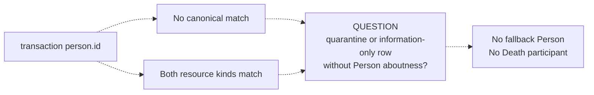

# Source-independent Mermaid

Status: **under review — design only**

Solid semantic edges are candidate RDF under the selected option. Dashed
arrows represent evidence or execution-context flow, not object properties.

## Option A — reviewed player-kind guarantee

```mermaid
flowchart LR
    ROW[Transaction row\nDescriptive ICE]
    PID[Provider person ID]
    GUARANTEE[Reviewed endpoint guarantee\nevery transaction Person is player-kind]
    PERSON[Person\ndata/player/{id}]

    PID -.-> GUARANTEE
    GUARANTEE -.->|licenses deterministic identity| PERSON
    ROW -->|is about| PERSON
```

Without the reviewed guarantee, the dashed identity step is not licensed and
the `/player/` target must not be hardcoded merely because the fixture is a
player.

## Option B — promoted-authority resolution

```mermaid
flowchart LR
    ROW[Transaction row\nDescriptive ICE]
    PIDVALUE[Transaction person.id]
    AUTHID[MLB Person\nNon-Name Identifier]
    PERSON[Canonical Person\ndata/player/{id} or data/person/{id}]
    RESOLVE[NiFi identity resolution\nunique designation match]
    CONTEXT[Source-local RML context\ncanonicalPersonIri]

    AUTHID -->|designates| PERSON
    PIDVALUE -.-> RESOLVE
    AUTHID -.-> RESOLVE
    RESOLVE -.-> CONTEXT
    CONTEXT -.->|IRI input, not RDF edge| ROW
    ROW -->|is about| PERSON
```

The authority identifier remains in its owning promoted graph. Transaction
RML receives the resolved IRI, not the people mapping or raw people payload.

## Unresolved and conflicting cases



No option infers a Player Role, team membership, or Person type assertion in
the transactions graph.
