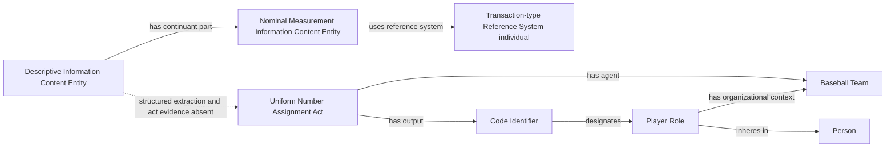

# Source-independent Mermaid

```mermaid
flowchart LR
    ROW[Descriptive Information Content Entity]
    TYPE[Nominal Measurement Information Content Entity]
    SYSTEM[Transaction-type Reference System individual]
    ACT[Uniform Number Assignment Act]
    TEAM[Baseball Team]
    CODE[Code Identifier]
    ROLE[Player Role]
    PERSON[Person]

    ROW -->|has continuant part| TYPE
    TYPE -->|uses reference system| SYSTEM
    ACT -->|has agent| TEAM
    ACT -->|has output| CODE
    CODE -->|designates| ROLE
    ROLE -->|has organizational context| TEAM
    ROLE -->|inheres in| PERSON
    ROW -.->|structured extraction and act evidence absent| ACT
```

The accepted world shape is shown for review; the current row does not
instantiate it and does not split the Player Role.
