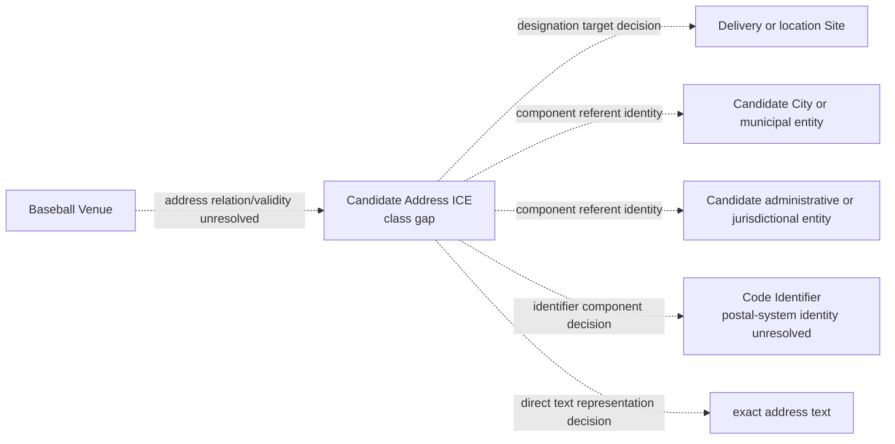

# Source-independent Mermaid

```mermaid
flowchart LR
    ADDRESS[Candidate Address ICE\nclass gap]
    SITE[Delivery or location Site]
    CITY[Candidate City or municipal entity]
    JURISDICTION[Candidate administrative or jurisdictional entity]
    POSTAL[Code Identifier\npostal-system identity unresolved]
    TEXT[exact address text]
    VENUE[Baseball Venue]

    ADDRESS -.->|designation target decision| SITE
    ADDRESS -.->|component referent identity| CITY
    ADDRESS -.->|component referent identity| JURISDICTION
    ADDRESS -.->|identifier component decision| POSTAL
    ADDRESS -.->|direct text representation decision| TEXT
    VENUE -.->|address relation/validity unresolved| ADDRESS
```

Dashed edges are modeling questions and do not invent address properties.
