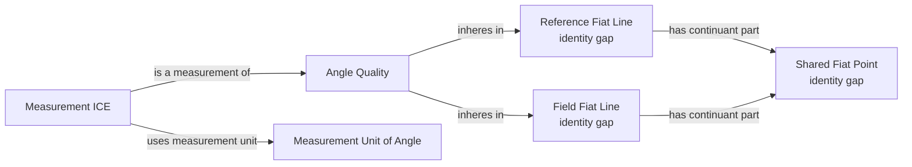

# Source-independent Mermaid

```mermaid
flowchart LR
    NORTH[Reference Fiat Line\nidentity gap]
    FIELDLINE[Field Fiat Line\nidentity gap]
    ORIGIN[Shared Fiat Point\nidentity gap]
    ANGLE[Angle Quality]
    MEASURE[Measurement ICE]
    UNIT[Measurement Unit of Angle]

    NORTH -->|has continuant part| ORIGIN
    FIELDLINE -->|has continuant part| ORIGIN
    ANGLE -->|inheres in| NORTH
    ANGLE -->|inheres in| FIELDLINE
    MEASURE -->|is a measurement of| ANGLE
    MEASURE -->|uses measurement unit| UNIT
```

The shape uses accepted relations. It does not approve which line, point, frame,
or unit MLB supplies.
