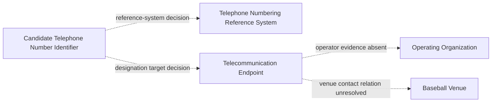

# Source-independent Mermaid

```mermaid
flowchart LR
    NUMBER[Candidate Telephone Number Identifier]
    SYSTEM[Telephone Numbering Reference System]
    ENDPOINT[Telecommunication Endpoint]
    ORG[Operating Organization]
    VENUE[Baseball Venue]

    NUMBER -.->|designation target decision| ENDPOINT
    NUMBER -.->|reference-system decision| SYSTEM
    ENDPOINT -.->|operator evidence absent| ORG
    ENDPOINT -.->|venue contact relation unresolved| VENUE
```

Every edge remains dashed because the field is excluded unless CONTACT-01 is
answered positively.
