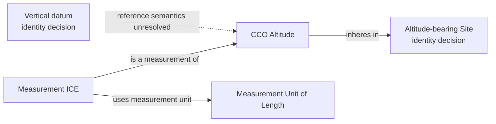

# Source-independent Mermaid

```mermaid
flowchart LR
    SITE[Altitude-bearing Site\nidentity decision]
    ALTITUDE[CCO Altitude]
    MEASURE[Measurement ICE]
    UNIT[Measurement Unit of Length]
    DATUM[Vertical datum\nidentity decision]

    ALTITUDE -->|inheres in| SITE
    MEASURE -->|is a measurement of| ALTITUDE
    MEASURE -->|uses measurement unit| UNIT
    DATUM -.->|reference semantics unresolved| ALTITUDE
```

The dashed datum edge is a dependency question, not a proposed property.
