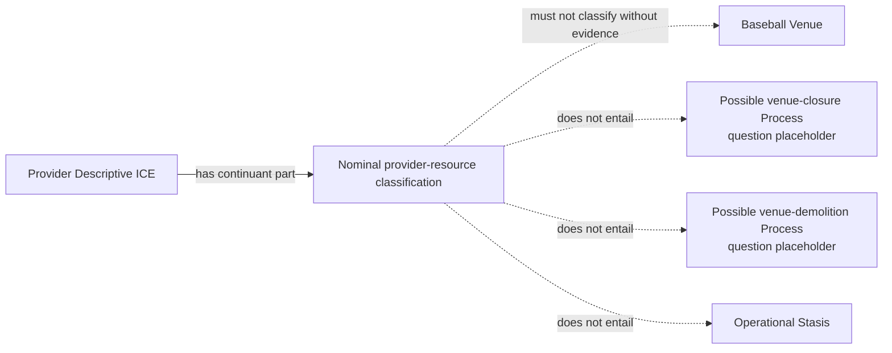

# Source-independent Mermaid

```mermaid
flowchart LR
    RECORD[Provider Descriptive ICE]
    STATUS[Nominal provider-resource classification]
    VENUE[Baseball Venue]
    CLOSURE[Possible venue-closure Process\nquestion placeholder]
    DEMOLITION[Possible venue-demolition Process\nquestion placeholder]
    OPERATION[Operational Stasis]

    RECORD -->|has continuant part| STATUS
    STATUS -.->|must not classify without evidence| VENUE
    STATUS -.->|does not entail| CLOSURE
    STATUS -.->|does not entail| DEMOLITION
    STATUS -.->|does not entail| OPERATION
```

The dashed edges are prohibited inferences.
