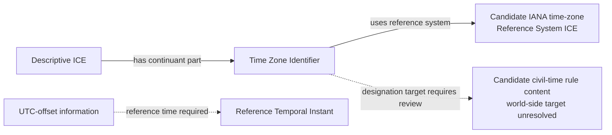

# Source-independent Mermaid

The diagram does not use a Spatial Region or assert an unscoped offset. The
designation target and identity of the time-zone rule content remain explicit
review blockers.
