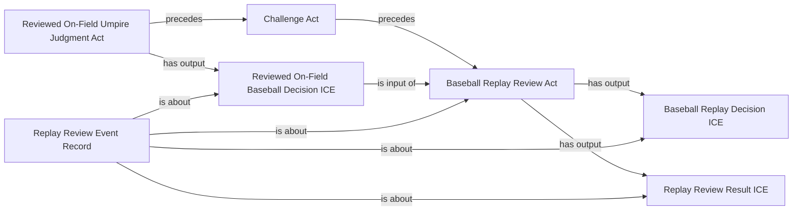

# Replay-review ontology design record

Status: **accepted on 2026-08-05**. This directory preserves the design review
that led to the authoritative implementation. The named classes, definitions,
taxonomy, comments, and examples are in
[`../../ontology/BaseballO.ttl`](../../ontology/BaseballO.ttl); the executable
logical axioms are in
[`../../ontology/BaseballO-axioms-overlay.ttl`](../../ontology/BaseballO-axioms-overlay.ttl).

The original candidate OWL snapshot is in
[`replay-review-proposed-overlay.ttl`](replay-review-proposed-overlay.ttl).
Every textual definition below uses a genus-differentia form and has a matching
equivalence axiom in the authoritative overlay. The accepted model introduces
classes but no object properties. Every object property is reused from BFO or
CCO.

## Modeling commitments

1. A challenge, the replay review, the original on-field judgment, and the
   replay judgment are distinct occurrents.
2. The reviewed on-field decision and replay decision are information content
   entities. They are not the judgment acts that produce them.
3. A replay review consumes exactly one on-field `BaseballDecisionICE` and
   produces exactly one replay `BaseballDecisionICE`.
4. An affirming review retains the same supported decision classification. An
   overturning review changes between the supported binary alternatives:
   ball/strike or out/safe.
5. The replay act is also classified by its final judgment type. For example,
   a safe-to-out review is an `OutJudgmentAct` because its operative output is
   an `OutDecisionICE`.
6. MLB source values `confirmed` and `upheld` both map to the proposed
   affirming pattern. The ontology does not distinguish them until the evidence
   threshold that separates them is represented. `overturned` maps to the
   overturning pattern.
7. A source record may support the existence of a generic reviewed on-field
   decision without supporting its more specific classification. Inferring the
   opposite original decision from an overturned final result requires an
   approved closed-domain rule for ball/strike or out/safe.
8. No individual base umpire is asserted for a reviewed base call unless the
   source identifies that umpire.

## Reused object properties

| Property | Source | Use in this proposal |
|---|---|---|
| `BFO_0000054` | BFO | role realized in process |
| `BFO_0000062` | BFO | process preceded by process |
| `BFO_0000063` | BFO | process precedes process |
| `cco:ont00001808` | CCO | information content entity is about entity |
| `cco:ont00001816` | CCO | continuant is output of process |
| `cco:ont00001841` | CCO | continuant is input of process |
| `cco:ont00001921` | CCO | process has input continuant |
| `cco:ont00001986` | CCO | process has output continuant |

No BaseballO object property is proposed or used in the candidate axioms.

## Core definitions

### Baseball Replay Review Act

**Definition:** A Baseball Replay Review Act is a Baseball Adjudication Act
that has input exactly one Baseball Decision ICE and has output exactly one
Baseball Decision ICE.

**Axiom:** Equivalent to `BaseballAdjudicationAct`, `has input exactly 1
BaseballDecisionICE`, and `has output exactly 1 BaseballDecisionICE`.

This definition distinguishes replay adjudication from an initial judgment by
making a prior decision an input.

### Reviewed On-Field Baseball Decision ICE

**Definition:** A Reviewed On-Field Baseball Decision ICE is a Baseball
Decision ICE that is input of a Baseball Replay Review Act.

**Axiom:** Equivalent to `BaseballDecisionICE` and `is input of some
BaseballReplayReviewAct`.

### Baseball Replay Decision ICE

**Definition:** A Baseball Replay Decision ICE is a Baseball Decision ICE that
is output of a Baseball Replay Review Act.

**Axiom:** Equivalent to `BaseballDecisionICE` and `is output of some
BaseballReplayReviewAct`.

The term is deliberately not named “final decision.” A later authorized review
could make a previously produced replay decision non-final.

### Reviewed On-Field Umpire Judgment Act

**Definition:** A Reviewed On-Field Umpire Judgment Act is an Umpire Judgment
Act that has output a Reviewed On-Field Baseball Decision ICE.

**Axiom:** Equivalent to `UmpireJudgmentAct` and `has output some
ReviewedOnFieldBaseballDecisionICE`.

### Baseball Replay Official Role

**Definition:** A Baseball Replay Official Role is a Baseball Adjudicator Role
that is realized in a Baseball Replay Review Act.

**Axiom:** Equivalent to `BaseballAdjudicatorRole` and `realized in some
BaseballReplayReviewAct`.

### Challenged Baseball Replay Review Act

**Definition:** A Challenged Baseball Replay Review Act is a Baseball Replay
Review Act that is preceded by a Challenge Act.

**Axiom:** Equivalent to `BaseballReplayReviewAct` and `preceded by some
ChallengeAct`.

## Challenge correction

The current authoritative `ChallengeAct` is a subclass of `ManagerAct`. That is
too narrow for player-initiated pitch challenges in the observed 2026 feed.
Acceptance of this proposal therefore requires changing the asserted parent of
`ChallengeAct` from `ManagerAct` to `BaseballAct`; an overlay can add axioms but
cannot retract the existing parent.

### Challenge Act — revised definition

**Definition:** A Challenge Act is a Baseball Act that is preceded by a
Baseball Judgment Act and precedes a Baseball Replay Review Act.

**Axiom:** Equivalent to `BaseballAct`, `preceded by some
BaseballJudgmentAct`, and `precedes some BaseballReplayReviewAct`.

### Manager Challenge Act

**Definition:** A Manager Challenge Act is a Challenge Act that is also a
Manager Act.

**Axiom:** Equivalent to the intersection of `ChallengeAct` and `ManagerAct`.

### Player Challenge Act

**Definition:** A Player Challenge Act is a Challenge Act that is also a Player
Act.

**Axiom:** Equivalent to the intersection of `ChallengeAct` and `PlayerAct`.

These subclasses retain the challenger distinction without building it into
the general challenge class.

## Affirming input-output patterns

### Ball-Affirming Baseball Replay Review Act

**Definition:** A Ball-Affirming Baseball Replay Review Act is a Ball Judgment
Act that is a Baseball Replay Review Act, has input a Ball Decision ICE, and has
output a Ball Decision ICE.

### Strike-Affirming Baseball Replay Review Act

**Definition:** A Strike-Affirming Baseball Replay Review Act is a Strike
Judgment Act that is a Baseball Replay Review Act, has input a Strike Decision
ICE, and has output a Strike Decision ICE.

### Out-Affirming Baseball Replay Review Act

**Definition:** An Out-Affirming Baseball Replay Review Act is an Out Judgment
Act that is a Baseball Replay Review Act, has input an Out Decision ICE, and has
output an Out Decision ICE.

### Safe-Affirming Baseball Replay Review Act

**Definition:** A Safe-Affirming Baseball Replay Review Act is a Safe Judgment
Act that is a Baseball Replay Review Act, has input a Safe Decision ICE, and has
output a Safe Decision ICE.

### Affirming Baseball Replay Review Act

**Definition:** An Affirming Baseball Replay Review Act is a Baseball Replay
Review Act that has one of the ball-to-ball, strike-to-strike, out-to-out, or
safe-to-safe decision patterns.

**Axiom:** Equivalent to the union of the four affirming pattern classes.

## Overturning input-output patterns

### Ball-to-Strike Baseball Replay Review Act

**Definition:** A Ball-to-Strike Baseball Replay Review Act is a Strike
Judgment Act that is a Baseball Replay Review Act, has input a Ball Decision
ICE, and has output a Strike Decision ICE.

### Strike-to-Ball Baseball Replay Review Act

**Definition:** A Strike-to-Ball Baseball Replay Review Act is a Ball Judgment
Act that is a Baseball Replay Review Act, has input a Strike Decision ICE, and
has output a Ball Decision ICE.

### Out-to-Safe Baseball Replay Review Act

**Definition:** An Out-to-Safe Baseball Replay Review Act is a Safe Judgment
Act that is a Baseball Replay Review Act, has input an Out Decision ICE, and has
output a Safe Decision ICE.

### Safe-to-Out Baseball Replay Review Act

**Definition:** A Safe-to-Out Baseball Replay Review Act is an Out Judgment Act
that is a Baseball Replay Review Act, has input a Safe Decision ICE, and has
output an Out Decision ICE.

### Overturning Baseball Replay Review Act

**Definition:** An Overturning Baseball Replay Review Act is a Baseball Replay
Review Act that has one of the ball-to-strike, strike-to-ball, out-to-safe, or
safe-to-out decision patterns.

**Axiom:** Equivalent to the union of the four overturning pattern classes.

The proposal makes `BallDecisionICE`, `StrikeDecisionICE`, `OutDecisionICE`,
and `SafeDecisionICE` mutually disjoint. Together with the exact-one input and
output restrictions, this prevents one review from satisfying incompatible
transition patterns.

## Review-result and record definitions

### Baseball Replay Review Result ICE

**Definition:** A Baseball Replay Review Result ICE is a Descriptive
Information Content Entity that is output of a Baseball Replay Review Act, is
about a Reviewed On-Field Baseball Decision ICE, and is about a Baseball Replay
Decision ICE.

The underlying IRI retains `BaseballReplayReviewDispositionICE` for identifier
stability. The label uses “Result ICE” so it cannot be mistaken for a BFO
disposition, which is a realizable dependent continuant.

**Comment:** This ICE describes how the replay decision relates to the reviewed
on-field decision.

**Example:** The information content that replay review overturned an on-field
safe decision and produced an out decision.

### Affirming Baseball Replay Review Result ICE

**Definition:** An Affirming Baseball Replay Review Result ICE is a Baseball
Replay Review Result ICE that is output of an Affirming Baseball Replay Review
Act.

**Subclass:** Baseball Replay Review Result ICE.

**Comment:** MLB source values `confirmed` and `upheld` both map here until an
evidence-based distinction between their epistemic thresholds is modeled.

**Example:** The information content that replay review affirmed an on-field
out decision by producing another out decision.

### Overturning Baseball Replay Review Result ICE

**Definition:** An Overturning Baseball Replay Review Result ICE is a Baseball
Replay Review Result ICE that is output of an Overturning Baseball Replay
Review Act.

**Subclass:** Baseball Replay Review Result ICE.

**Comment:** This class represents a change between supported decision
alternatives, not merely the occurrence of a review.

**Example:** The information content that replay review overturned the on-field
safe decision on Shohei Ohtani's pickoff play and produced an out decision.

### Baseball Replay Review Event Record

**Definition:** A Baseball Replay Review Event Record is a Baseball Event
Record that is about a Baseball Replay Review Act, a Reviewed On-Field Baseball
Decision ICE, a Baseball Replay Decision ICE, and a Baseball Replay Review
Result ICE.

## Proposed event pattern

For the Ohtani example, the rich pattern would be a
`SafeToOutBaseballReplayReviewAct`. The Cubs' challenge follows a reviewed
on-field safe judgment; the review consumes a `SafeDecisionICE`, produces an
`OutDecisionICE`, and produces an overturning review result. The final pickoff
out remains the operative structured outcome.

## Remaining extension decisions

The core pattern has been promoted. These questions remain available for later
extension without blocking the accepted model:

1. Whether a replay official should necessarily bear `UmpireRole` as well as
   `BaseballReplayOfficialRole`.
2. Whether the binary-opposite original decision may be derived for an
   overturned pitch-result or out-safe review when the feed supplies only the
   final structured outcome and narrative review result.
3. Whether future evidence modeling supports distinct `confirmed` and
   `upheld` subclasses; both are currently normalized to affirming.
4. Which additional transition families are needed for replay reviews outside
   ball/strike and out/safe.
