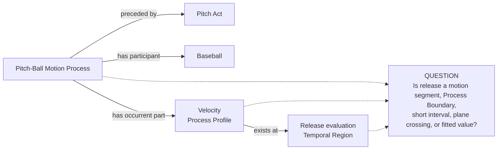
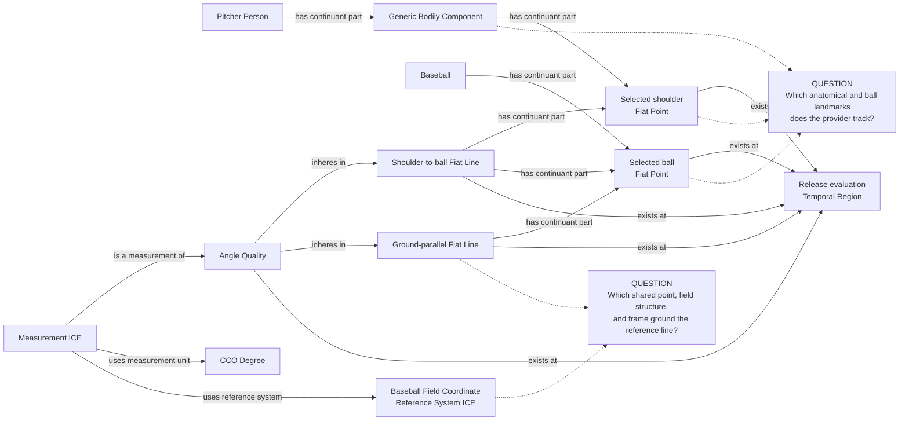

# Source-specific Mermaid

Status: **under review — design only**

Solid edges use existing vocabulary but are not authorized RDF. Dotted lines
converge on explicit questions and are not proposed relations.

## Release-local motion context

The `exists at` edge does not determine what the release region is. The dotted
question must be answered from method evidence before execution.

## World-side arm-angle geometry

The choice to draw the ground-parallel line through the ball point is a visible
review question, not a silent claim. If official evidence selects another
shared point, the Mermaid must be revised before approval.
