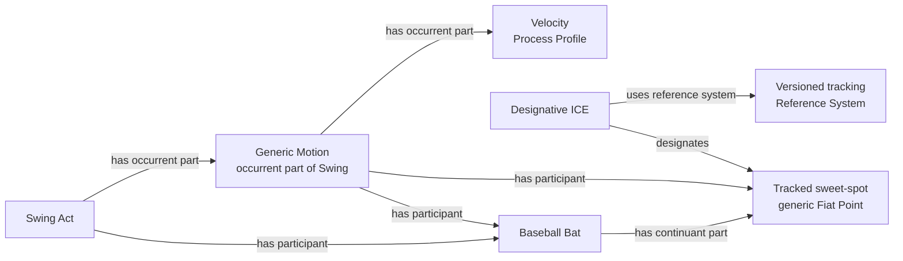
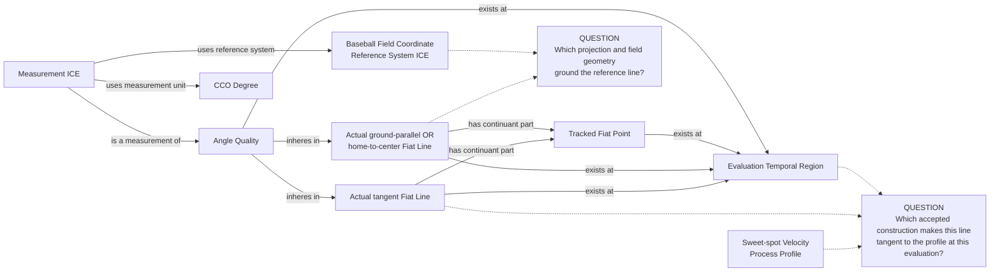
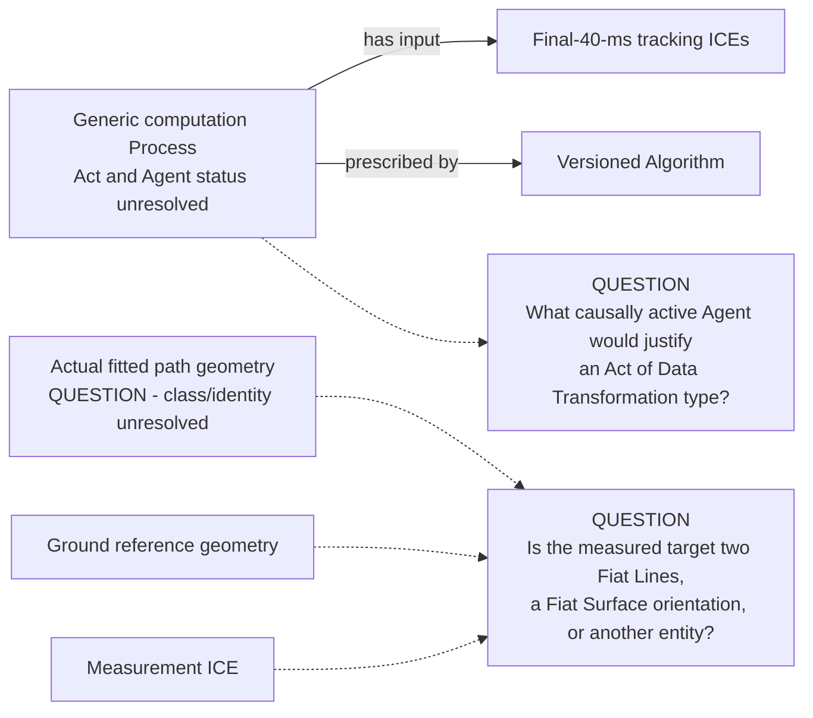

# Source-specific Mermaid

Status: **under review — design only**

Solid edges use accepted vocabulary but are not authorized RDF. Dotted lines
terminate in question nodes and do not propose object properties.

## Sweet-spot motion and Process Profile

The particular generic Motion and Fiat Point carry the reality-side structure;
no `AttackAngleRecord` or `SweetSpotVelocityICE` replaces them.

## Attack angle and attack direction

The dotted blockers prevent an ICE from embezzling the tangent, projection,
field direction, or temporal evaluation structure.

## Swing-path tilt remains a separate geometry question

No output edge or angle measurement is proposed until the fitted world-side
geometry and target are reviewed.
