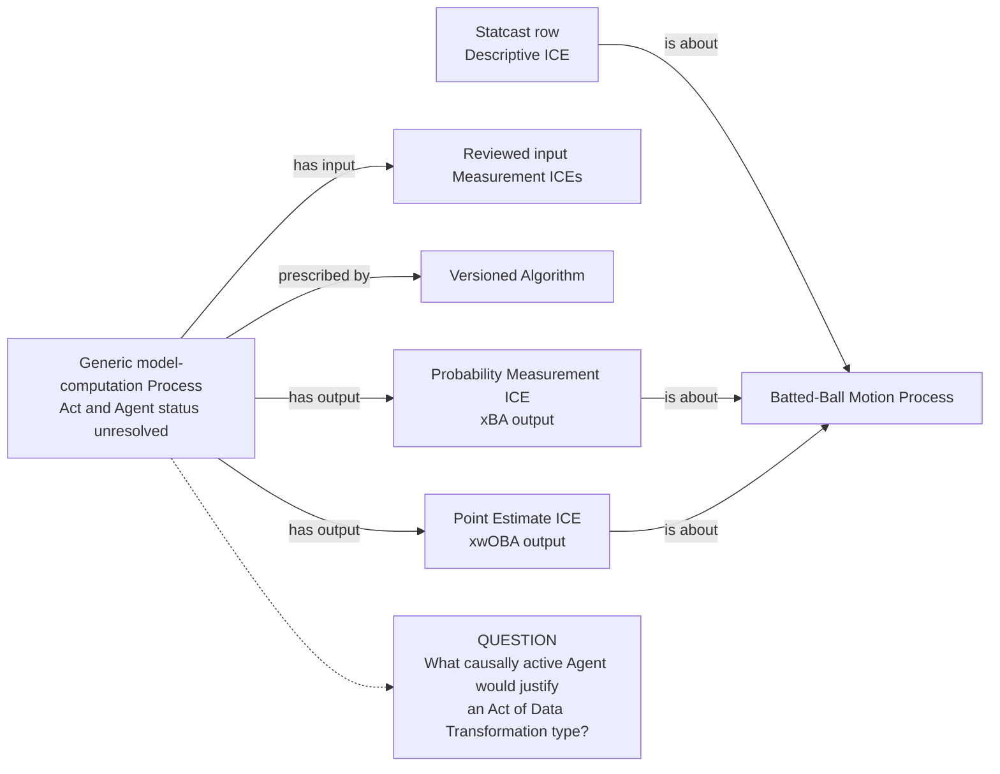
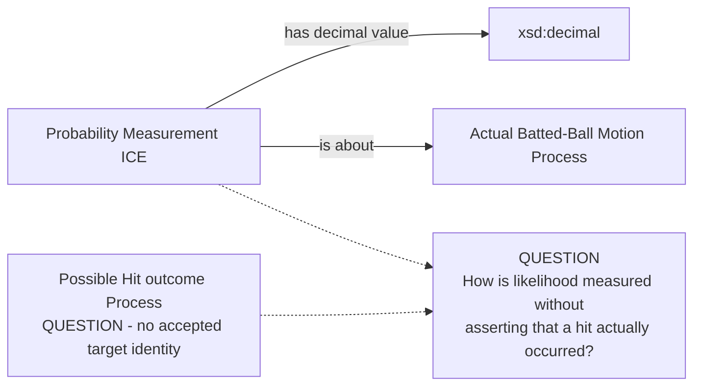
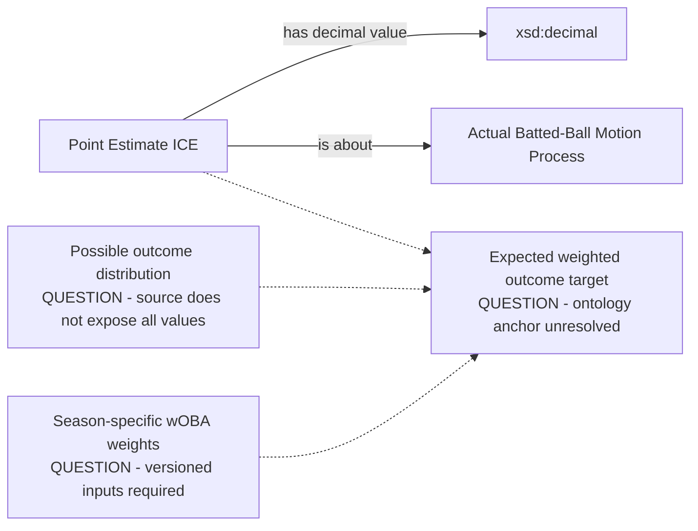

# Source-specific Mermaid

Status: **under review — design only**

Solid edges use accepted vocabulary but remain unapproved. Dotted lines point
to unresolved target/model questions and are not object-property proposals.

## Shared provider model execution

The input edges require versioned evidence; they do not authorize Statcast to
duplicate MLB-owned launch measurements. If input ICEs live in another
promoted graph, the source-local mapping cannot require them.

## xBA target blocker

The required `is a measurement of` edge is intentionally absent until the
possible Process target is accepted.

## xwOBA target and weighting blocker

Neither the lexical field name nor the scalar alone supplies the missing
distribution, weights, or measured entity.
