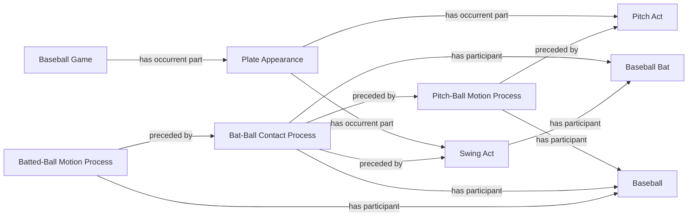
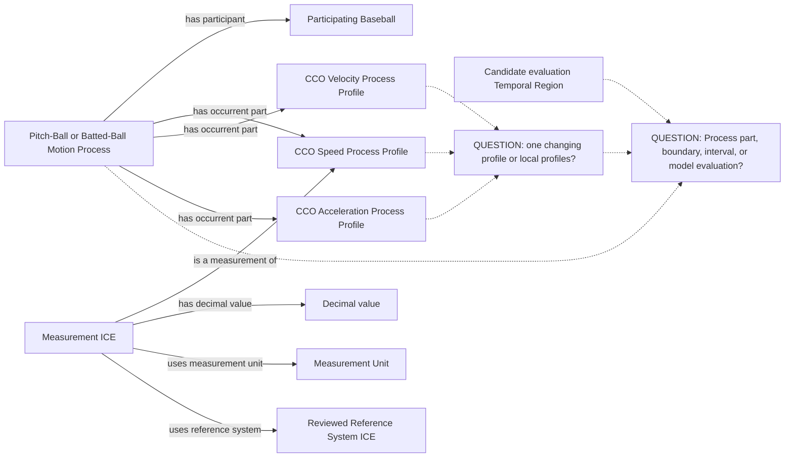
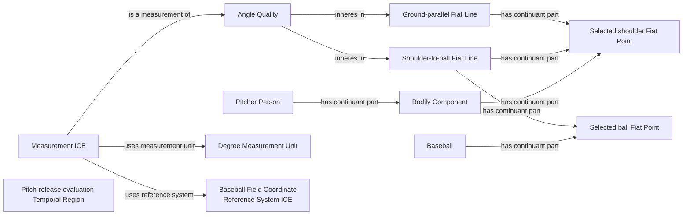
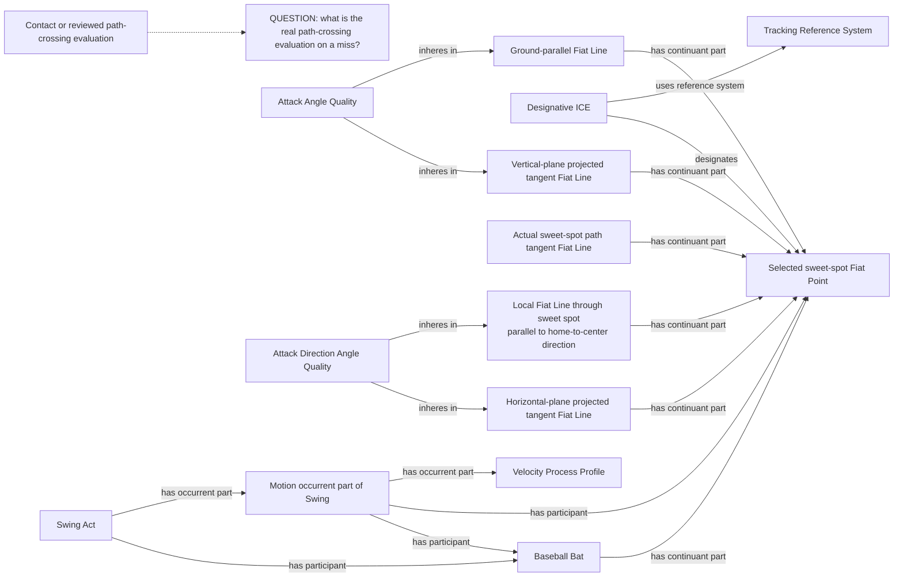
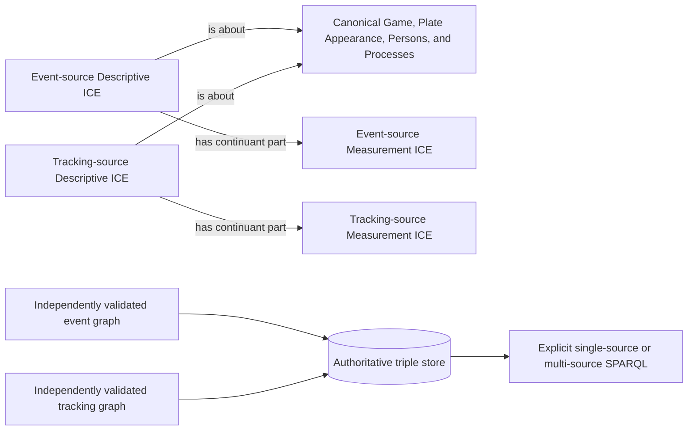

# Source-independent Mermaid

Status: **under review — design only**

Solid arrows name accepted BFO, CCO, or BaseballO relations. Dotted arrows
terminate in unresolved questions and are not proposed object properties.
Source fields never replace the world entities shown here.

## 1. The physical process chain already exists

No Statcast-specific Game, Plate Appearance, Pitch, contact, or ball-motion
universal is needed. A swing-and-miss follows the left side of this history but
does not instantiate the contact or batted-ball branches.

## 2. Changing motion is represented by Process Profiles

The Measurement ICE targets exactly one reviewed profile. The diagram does not
assert that every profile is present for every motion, that one value is
constant throughout the motion, or that an undocumented evaluation is an
instant. Scalar speed uses Speed; Velocity requires direction and a frame.

## 3A. Throwing-arm angle requires actual geometry

The shoulder Fiat Point is the shared point required by `AngleQuality`; the
geometry is evaluated at pitch release.

## 3B. Bat tracking requires motion, points, lines, and evaluation scope

At actual contact, the Bat-Ball Contact Process can supply reviewed temporal
context. A swing-and-miss must not create contact merely to support a metric.
The comparison line is local to the sweet-spot evaluation point; the sweet spot
is not asserted as part of the actual home-to-center field line. Only the
swing-and-miss path-crossing entity remains unresolved here.

## 4. Independent evidence converges on shared world entities

Identity/join keys are used transiently to resolve `WORLD`; they do not license
duplicate world assertions. Each source keeps its own record, measurement,
provenance, RML, SHACL, NiFi lane, and promoted graph. Integration occurs only
after independent validation and promotion.
