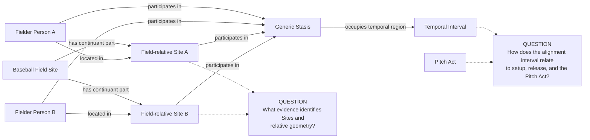
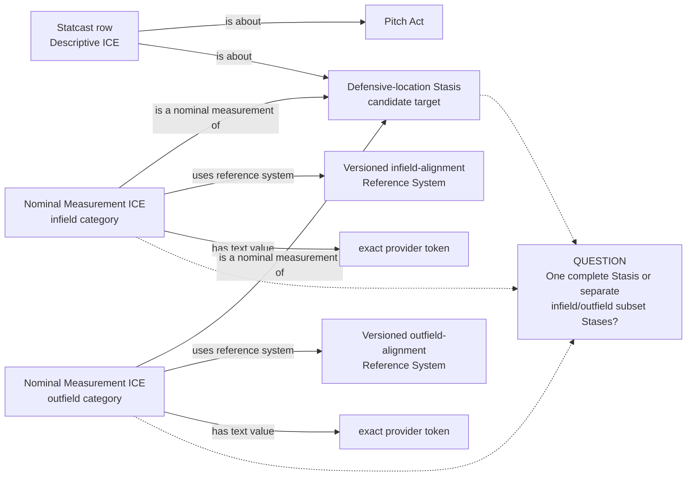

# Source-specific Mermaid

Status: **under review — design only**

Solid edges form a candidate using existing vocabulary. Dotted lines expose
remaining identity and temporal questions; they do not propose relations.

## Actual player-Site structure and Stasis

The generic Stasis is a candidate only if the preserved location condition and
its interval are supported. It does not realize a Role or Function.

## Provider nominal classifications

If actual Sites and Stasis cannot be established, these solid classification
edges must be removed before review rather than redirected to the source row,
Pitch, Team, or players.
