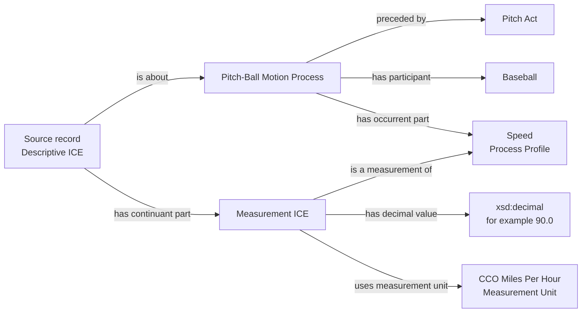
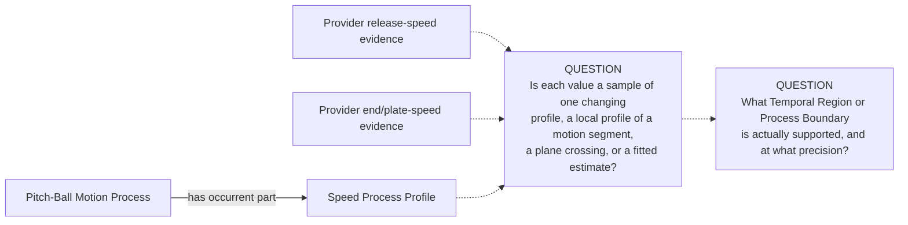
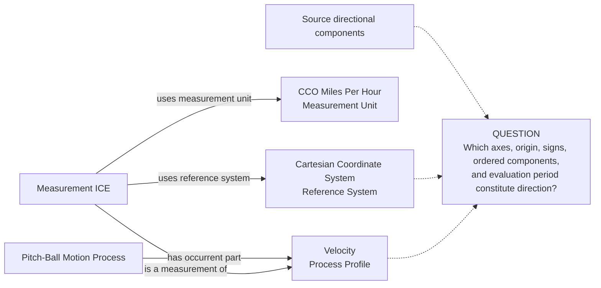
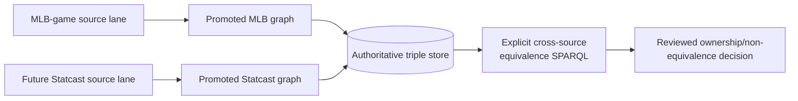

# Source-independent Mermaid

Status: **under review — design only**

Solid edges show the candidate minimum graph using accepted BFO/CCO/BaseballO
relations. They are not authorized RDF while the package is active. Dotted
lines terminate in explicit question nodes; they are not proposed properties.

## Scalar pitch speed

The Process Profile is the world-side measurement target. The decimal and unit
belong to the Measurement ICE. No mph literal is attached to the Pitch Act,
Baseball, or Pitch-Ball Motion Process. No Act of Measuring is asserted from
the result alone.

## The evaluation "time shot" remains unresolved

No `release profile`, `plate profile`, evaluation instant, plane-crossing, or
source-field class is proposed. The missing evaluation structure cannot be
hidden in the Measurement ICE label or IRI.

## Conditional directional Velocity shape

This diagram is conditional: it becomes eligible only after direction and
frame semantics are accepted. The solid relations themselves are existing
vocabulary, but the graph is not approved by this draft.

A scalar `release_speed` value uses the first diagram, not this one. A
direction-bearing Velocity cannot be recovered by renaming the scalar field.

## Detachable source ownership

The diagram contains no RML or SHACL edge between sources. Until the comparison
and ontologist decision are complete, `release_speed` remains excluded from
Statcast mapping as an unresolved duplicate.
