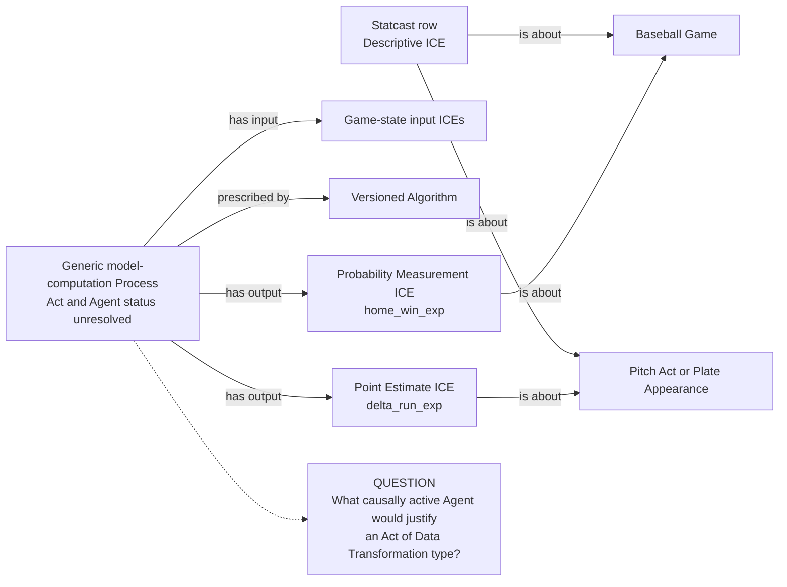
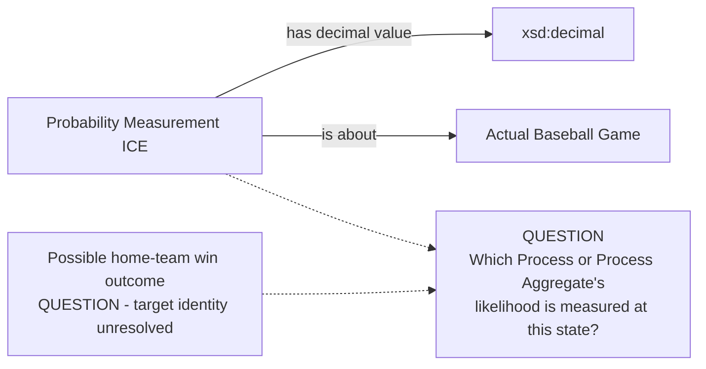
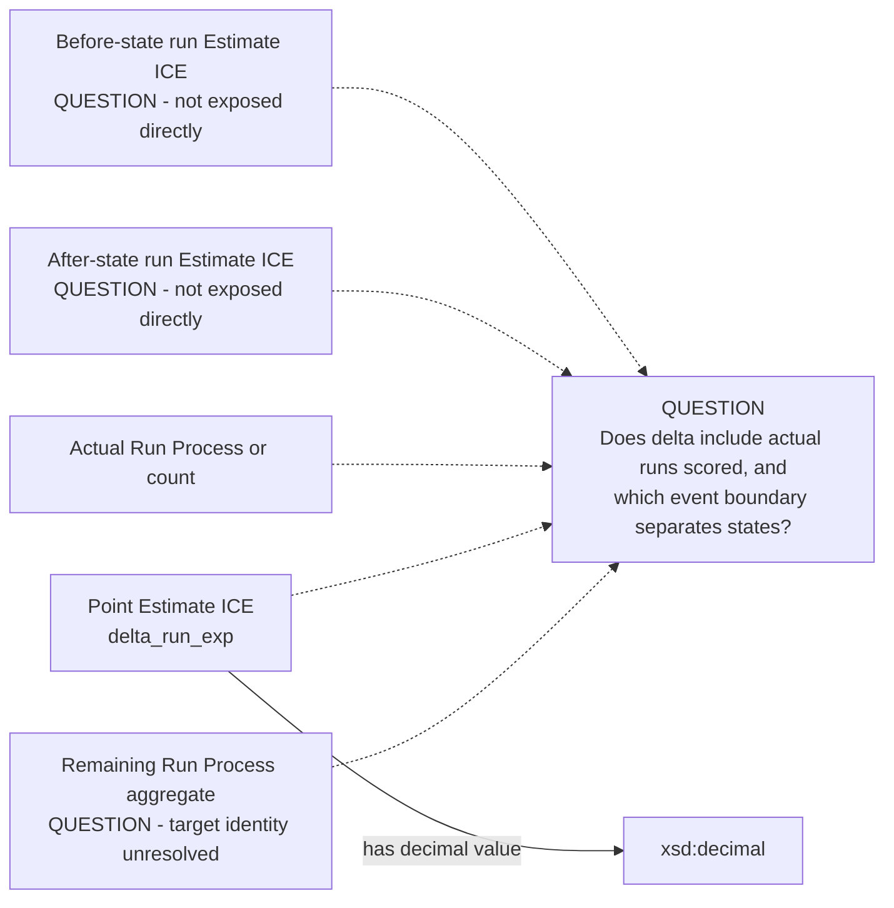

# Source-specific Mermaid

Status: **under review — design only**

Solid edges are accepted vocabulary in a candidate source shape, not approved
RDF. Dotted branches are unresolved modeling questions, not properties.

## Versioned model execution and state evidence

The state inputs are not permission to duplicate MLB-game state in Statcast
RML. Their exact before/after scope and model identity remain required evidence.

## Home-win probability target blocker

No `is a measurement of` edge is proposed until the possible target is
accepted.

## Run-expectancy delta blocker

The scalar does not by itself supply two state estimates, a formula, or a
future Process target.
