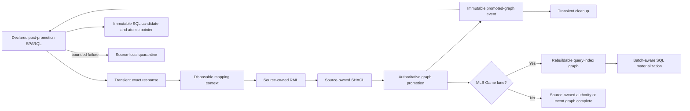

# Game ingestion and RDF loading

Run all commands in this document from the `Baseball/` project directory.

These scripts are pipeline components. NiFi invokes them for source-owned MLB
API acquisition; developers may also use the direct game importer as a focused
fallback. Directly imported evidence retains its byte-identical archive. API
responses are transient: NiFi preserves exact bytes through the owning
promotion and cleanup gates, retains compact hashes and evidence, then removes
the raw JSON.

The accepted games, organizations, people, venues, and transactions lanes are
independent NiFi process groups. NiFi owns discovery, dependency order,
mapping, validation, promotion, retry, quarantine, cleanup, and provenance.
Bulk and daily acquisition is released only after the lane has a completed
proof for its current RML and SHACL hashes. Provision or submit a lane through
its source-owned `sources/<source-id>/nifi/provision.ps1`; the exact switches
and current process-group inventory are in the
[NiFi runbook](../../infra/nifi/README.md).



## Direct fallback import

From the project directory, import the checked-in historical fixture without making an external request:

```powershell
.\scripts\pipeline\import-game-json.ps1 -InputJson .\data\raw\game-566279.json
```

This bundled importer remains a local fallback and parity reference. There is
no active NiFi manual inbox. The fallback still supports `-ForceRdfLoad` and
`-ArchiveOnly`.

`run-rml.ps1` runs the mapping-specific collision and source preflight and
stages a byte-identical JSON copy. It then creates an isolated execution-context
copy containing the ancestor IDs needed by nested pitch records, materializes
guarded root-identifier markers only in its temporary mapping, invokes the
pinned mapper in strict mode, and validates complete source-to-RDF coverage.
Direct fallback execution requires the generated graph to conform to the
authoritative SHACL profile before it leaves staging. The NiFi path records the
RML output as deferred, then a separate validation processor reruns the RDF
parser and SHACL profile before the graph-load processor can receive it.
The RML stage performs source-coverage and RDF-mechanics checks. The separate
NiFi validation stage owns semantic graph admission: it runs the authoritative
SHACL profile and does not duplicate those competency-question answers in an
imperative Python graph review. The context is disposable and never replaces
the raw archive. The manifest
records source, context-builder, execution-context, source-mapping,
effective-mapping, and output hashes.

`load-game-graph.ps1` parses the Turtle again before using Graph Store Protocol
`PUT`. Repeating the load replaces the same graph rather than appending
duplicate statements. A successful authoritative load is followed by
`build-query-index.ps1`, which builds and atomically replaces the smaller
per-game query-index graph from the reviewed components under
[`sparql/query-index/`](../../sparql/query-index/). Compiled N-Triples must pass
the query-index SHACL profile before the graph is replaced. For the MLB Game
NiFi lane, `JenaQueryIndex.java` runs those unchanged CONSTRUCT components over
the validated per-game RDF in an isolated Jena dataset instead of making the
shared dataset execute the construction workload. The final index write remains
serialized, and exact result-row equivalence is checked before the graph-pair
commit. A failed index build removes the derived graph but never deletes or
changes the authoritative graph.

Run the complete offline acceptance check with:

```powershell
.\scripts\pipeline\test-manual-vertical-slice.ps1 -ForceRdfLoad
```

The acceptance check also compares exact authoritative/index result rows for
game dimensions, UTF-8 label fidelity, plate appearances, plate-appearance
results, hits, pitches, pitch calls, batting acts, contacts, runner resolutions,
stolen bases, and assignments.

## Corpus query audit

With the eight 2026-08-03 authoritative graphs loaded, verify all 51 canned
queries against the checked-in row-set baseline:

```powershell
powershell -ExecutionPolicy Bypass -File `
  .\scripts\pipeline\audit-canned-queries.ps1 `
  -VerifyBaseline
```

Run the same command without `-VerifyBaseline` only when intentionally
regenerating the reviewed baseline. The audit explicitly scopes every query to
the eight corpus graphs, detects empty and duplicate result sets, and records
order-independent RDF-term-aware hashes under
[`benchmarks/canned-query-audit/`](../../benchmarks/canned-query-audit/).

Audit the 17 advanced semantic queries independently with:

```powershell
powershell -ExecutionPolicy Bypass -File `
  .\scripts\pipeline\audit-advanced-queries.ps1 `
  -VerifyBaseline
```

That audit reads each query's evidence mode and zero-row policy from the
advanced catalog. Integrity rows are retained as findings rather than being
misreported as failed execution.

## Query-index performance evidence

With the eight corpus graphs and their current indexes loaded, reproduce the
exact-result corpus benchmark and alternating 20-sample timings with:

```powershell
powershell -ExecutionPolicy Bypass -File `
  .\scripts\pipeline\benchmark-query-index-corpus.ps1
```

The checked-in report is under
[`benchmarks/query-index/`](../../benchmarks/query-index/). To capture direct
TDB2 query execution, stop Fuseki first, run
`capture-tdb2-query-execution.ps1`, and restart Fuseki immediately afterward.
The capture script refuses to run while port 3031 is open so two processes
cannot access the datastore concurrently.

## Reviewed query execution

Run one of the nineteen measured query pairs through its reviewed automatic route:

```powershell
.\scripts\pipeline\run-reviewed-query.ps1 `
  -Name hits-by-player-and-venue `
  -Layer Auto
```

`Auto` uses the sixteen evidence-backed indexed routes and keeps three reviewed
routes authoritative. Indexed execution is allowed only when every
loaded game has current authoritative/index artifacts, hashes and counts, a
current local build manifest, and matching graph metadata. Otherwise Auto
falls back to the authoritative query. `-Layer Indexed` fails closed instead.
Use `-VerifyEquivalent` for an immediate exact row comparison.

The indexed `hitless-games-by-player` route additionally relies on those
freshness checks plus the build-time proof that every selected graph has
complete `PlateAppearanceFact` and `HitFact` row sets. It must not be executed
directly against an unverified index graph.

Exercise all normal and failure routes with:

```powershell
.\scripts\pipeline\test-reviewed-query-routing.ps1
```

## Compiling reusable DSQs

[`compile-dsq-query.py`](compile-dsq-query.py) turns a declarative DSQ spec into
complete SPARQL using the hash-pinned modules under
[`sparql/query-modules/`](../../sparql/query-modules/). Version 1 accepts one
primary indexed fact grain, reviewed game dimensions, safe `VALUES`, distinct
counts, and additive reduction over disjoint game partitions. It rejects raw
SPARQL injection, fact-to-fact joins, and batch averages.

NiFi should compile the reviewed spec, divide the corpus into measured disjoint
game batches, persist the additive rows in SQL, and derive final rankings or
rates there. One exact `--index-graph` compiles to a concrete named-graph query;
multiple graph options compile to a bounded `VALUES ?indexGraph` query. This is
the reusable path for a newly admitted DSQ, not a second scheduler.

## Portable dehydration packages

[`export-dehydration-package.ps1`](export-dehydration-package.ps1) creates a
closed, hash-inventoried package containing the byte-identical raw game, exact
authoritative RDF, exact query-index RDF, build manifests, and repository
generation contracts. It refuses stale hashes and dirty repository trees by
default. [`restore-dehydration-package.ps1`](restore-dehydration-package.ps1)
validates only unless explicit `-Load` is supplied; loading removes the old
derived graph, restores the authoritative graph, restores its matching index,
and verifies graph counts and metadata.

The full format and commands are in
[`sparql/query-index/dehydration-package.md`](../../sparql/query-index/dehydration-package.md).
Offline negative regressions prove that changed package bytes are rejected and
that malformed `CONSTRUCT` input removes the stale index without damaging the
authoritative graph.

## Clean NiFi MLB-game lane

The replacement flow is source-owned rather than assembled from shared global
configurators. Start the local NiFi runtime, provision the stopped group, and
optionally submit exactly one proof from the repository root:

```powershell
.\Baseball\scripts\infra\start-nifi.ps1
.\Baseball\sources\mlb-game\nifi\provision.ps1
.\Baseball\sources\mlb-game\nifi\provision.ps1 -RunProof -ProofGamePk 566279
```

The process group implements this visible order for each final game:

```text
MLB Games API -> transient JSON -> RML -> source SHACL
  -> atomic authoritative/index graph-pair promotion
  -> approved SPARQL materialization -> SQLite -> cleanup
```

Schedule discovery and the 05:00 Eastern trigger are part of this same source
group. A schedule response is reduced to a compact batch manifest plus final
game requests; raw API responses remain transient. NiFi owns dependency order,
three-attempt stage retries, source-local quarantine, and provenance. The
source component
[`stage.ps1`](../../sources/mlb-game/pipeline/stage.ps1) invokes the accepted
mapping, current SHACL profile, graph-pair transaction, query-index builder, and
serving materializer. The direct importer remains a developer fallback and is
not the routine workflow.

Successful runs delete the API JSON and redundant serialized Turtle only after
the source-owned promotion and cleanup contract is satisfied. Corpus game runs
record deferred materialization work in a compact batch manifest; the
pending-batch processor promotes one SQL build after every expected game has a
current graph pair. Failed runs retain the payload under
`%LOCALAPPDATA%\BaseballO\state\pipeline\quarantine\mlb-game`.
Stage and promotion evidence remains under the corresponding `evidence`
tree. Inspect that evidence after completion or failure; do not continuously
watch an ordinary run.

## External acquisition schedule

Every active MLB source group owns its `0 0 5 * * ?` trigger, interpreted in
America/New_York. The game group discovers completed games from the schedule
endpoint. People and venues discover their populations before issuing
per-record detail requests. Teams, leagues, divisions, and transactions retain
their separate endpoint-specific connectors. Stopping or rebuilding one group
does not stop an unrelated source.

## Analytical serving

Bounded game proofs invoke
[`materialize-serving-layer.py`](materialize-serving-layer.py) immediately.
Schedule-driven corpus runs mark each game for deferred materialization. The
NiFi-owned pending-batch stage waits until every expected game has a current
promotion and then invokes the materializer once for the ready batch. It runs
the approved serving grains and all 56 static DSQs, validates a candidate
SQLite database, and promotes it by atomically replacing
`%LOCALAPPDATA%\BaseballO\state\serving\current.json`. Versioned builds remain
derived and rebuildable from persistent RDF.

Every DSQ is persisted in its own graph-partitioned `dsq_*` table under the
exact inventory in `serving/dsq-materializations.json`. The dedicated `DSQ SQL
Materialization` NiFi group owns explicit full backfills; the MLB Game
pending-batch stage owns normal post-ingest refreshes. Neither path admits a UI
route merely because its rows were materialized.

The Explorer may use live SPARQL for research questions that are not
materialized. Routine routes move to SQL only after equivalence is established.
If a candidate serving build fails, the prior pointer remains active and the
RDF graph pair is not rolled back.

Every successful source promotion first invokes
[`emit-promoted-graph-event.py`](emit-promoted-graph-event.py). Its immutable,
idempotent outbox record binds the source module, graph, scope, pipeline run,
triple count, and exact promotion-evidence hash. The shared `Analytical
Serving` NiFi group consumes only declared authority dependencies. Corrections
replace the affected graph partition rather than appending a second version.

[`prove-serving-equivalence.py`](prove-serving-equivalence.py) is the manual
NiFi-owned pre-admission comparison for PAQ, Advanced, Explore, Empty Games,
and Derived families. [`query-serving-candidate.py`](query-serving-candidate.py)
exposes pending SQL only to that loopback proof route; normal UI admission
remains controlled by `serving/contract.json`.
Explore-family proof includes every non-enum filter option used by those
families, so admitting a result route cannot silently leave its supporting
option lists on live RDF. Failed same-corpus checks retain both the
authoritative and candidate SQL fingerprints in their immutable evidence.
