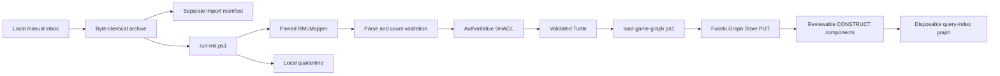

# Manual game import and RDF loading

These scripts implement the active, local-only path from a deliberately supplied completed-game JSON document to its Fuseki named graph.



## Direct manual import

From the repository root, import the checked-in historical fixture without making an external request:

```powershell
.\scripts\pipeline\import-game-json.ps1 -InputJson .\data\raw\game-566279.json
```

The importer parses the supplied document without rewriting it, verifies `gamePk`, season, and game state, stores a byte-identical SHA-256-addressed archive, and writes import metadata separately. Non-final documents are safely archived but do not reach RML. Repeating an identical final document skips mapping only when the raw hash, tracked mapping hash, mapper version, RML manifest, and expected Fuseki assertion all match; `-ForceRdfLoad` overrides that optimization. `-ArchiveOnly` preserves and records the input without invoking RML or Fuseki.

`run-rml.ps1` runs the mapping-specific collision and source preflight and
stages a byte-identical JSON copy. It then creates an isolated execution-context
copy containing the ancestor IDs needed by nested pitch records, materializes
guarded root-identifier markers only in its temporary mapping, invokes the
pinned mapper in strict mode, and validates complete source-to-RDF coverage.
The generated graph must also conform to the explicit authoritative SHACL
profile before it can leave the staging directory.
The context is disposable and never replaces the raw archive. The manifest
records source, context-builder, execution-context, source-mapping,
effective-mapping, and output hashes.

`load-game-graph.ps1` parses the Turtle again before using Graph Store Protocol
`PUT`. Repeating the load replaces the same graph rather than appending
duplicate statements. A successful authoritative load is followed by
`build-query-index.ps1`, which builds and atomically replaces the smaller
per-game query-index graph from the reviewed components under
[`sparql/query-index/`](../../sparql/query-index/). Compiled N-Triples must pass
the query-index SHACL profile before the graph is replaced. A failed index build
removes the derived graph but never deletes or changes the authoritative graph.

Run the complete offline acceptance check with:

```powershell
.\scripts\pipeline\test-manual-vertical-slice.ps1 -ForceRdfLoad
```

The acceptance check also compares exact authoritative/index result rows for
game dimensions, UTF-8 label fidelity, plate appearances, plate-appearance
results, hits, pitches, pitch calls, batting acts, contacts, runner resolutions,
stolen bases, and assignments.

## Corpus query audit

With the eight 2026-08-03 authoritative graphs loaded, verify all 48 canned
queries against the checked-in row-set baseline:

```powershell
powershell -ExecutionPolicy Bypass -File `
  .\scripts\pipeline\audit-canned-queries.ps1 `
  -VerifyBaseline
```

Run the same command without `-VerifyBaseline` only when intentionally
regenerating the reviewed baseline. The audit explicitly scopes every query to
the eight corpus graphs, detects empty and duplicate result sets, and records
order-independent RDF-term-aware hashes under
[`benchmarks/canned-query-audit/`](../../benchmarks/canned-query-audit/).

Audit the 17 advanced semantic queries independently with:

```powershell
powershell -ExecutionPolicy Bypass -File `
  .\scripts\pipeline\audit-advanced-queries.ps1 `
  -VerifyBaseline
```

That audit reads each query's evidence mode and zero-row policy from the
advanced catalog. Integrity rows are retained as findings rather than being
misreported as failed execution.

## Query-index performance evidence

With the eight corpus graphs and their current indexes loaded, reproduce the
exact-result corpus benchmark and alternating 20-sample timings with:

```powershell
powershell -ExecutionPolicy Bypass -File `
  .\scripts\pipeline\benchmark-query-index-corpus.ps1
```

The checked-in report is under
[`benchmarks/query-index/`](../../benchmarks/query-index/). To capture direct
TDB2 query execution, stop Fuseki first, run
`capture-tdb2-query-execution.ps1`, and restart Fuseki immediately afterward.
The capture script refuses to run while port 3030 is open so two processes
cannot access the datastore concurrently.

## Reviewed query execution

Run one of the eighteen measured query pairs through its reviewed automatic route:

```powershell
.\scripts\pipeline\run-reviewed-query.ps1 `
  -Name hits-by-player-and-venue `
  -Layer Auto
```

`Auto` uses the fifteen evidence-backed indexed routes and keeps the three
neutral routes authoritative. Indexed execution is allowed only when every
loaded game has current authoritative/index artifacts, hashes and counts, a
current local build manifest, and matching graph metadata. Otherwise Auto
falls back to the authoritative query. `-Layer Indexed` fails closed instead.
Use `-VerifyEquivalent` for an immediate exact row comparison.

The indexed `hitless-games-by-player` route additionally relies on those
freshness checks plus the build-time proof that every selected graph has
complete `PlateAppearanceFact` and `HitFact` row sets. It must not be executed
directly against an unverified index graph.

Exercise all normal and failure routes with:

```powershell
.\scripts\pipeline\test-reviewed-query-routing.ps1
```

## Portable dehydration packages

[`export-dehydration-package.ps1`](export-dehydration-package.ps1) creates a
closed, hash-inventoried package containing the byte-identical raw game, exact
authoritative RDF, exact query-index RDF, build manifests, and repository
generation contracts. It refuses stale hashes and dirty repository trees by
default. [`restore-dehydration-package.ps1`](restore-dehydration-package.ps1)
validates only unless explicit `-Load` is supplied; loading removes the old
derived graph, restores the authoritative graph, restores its matching index,
and verifies graph counts and metadata.

The full format and commands are in
[`sparql/query-index/dehydration-package.md`](../../sparql/query-index/dehydration-package.md).
Offline negative regressions prove that changed package bytes are rejected and
that malformed `CONSTRUCT` input removes the stale index without damaging the
authoritative graph.

## NiFi manual inbox

Configure and start the local-only flow:

```powershell
.\scripts\infra\configure-nifi-foundation.ps1
.\scripts\infra\configure-nifi-games-manual.ps1 -Enable
```

The command prints the absolute inbox path, normally:

```text
%LOCALAPPDATA%\BaseballO\state\pipeline\inbox\games
```

Copy a completed-game JSON document into that directory. NiFi assigns a collision-safe staging filename, invokes the guarded importer, and routes command failures to quarantine. The source bytes remain available in the content-addressed raw archive or failure quarantine.

Submit a checked-in date range as one monitored NiFi corpus run with:

```powershell
.\scripts\pipeline\submit-game-corpus-to-nifi.ps1 `
  -FromDate 2026-07-14 `
  -ThroughDate 2026-08-06
```

The command starts the local stack when necessary, configures and enables the
manual-inbox flow, copies each unique final game into the inbox with a
collision-safe name, and waits until the authoritative and query-index
manifests match the active RML, context builder, and index contract. Duplicate
game inputs with identical bytes are submitted once; differing bytes for the
same game fail closed. NiFi quarantine causes the corpus run to fail
immediately. Use `-NoWait` only when another process will monitor the run.
Resume monitoring an existing submission without enqueueing anything with:

```powershell
.\scripts\pipeline\monitor-nifi-corpus-submission.ps1 -RunId <submission-run-id>
```

The run ID and complete submitted-game inventory are stored in the submission
manifest printed by the producer command.

## Explicitly approved external acquisition

`acquire-daily-games.ps1` retains a fail-closed approval guard and runs only
when the caller supplies `-ExternalDataAccessApproved`. It archives schedules
and game feeds by content hash with separate manifests. Its NiFi processors
remain stopped; there is no unattended network-acquisition schedule.
