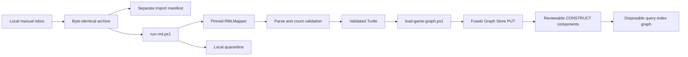

# Manual game import and RDF loading

These scripts implement the active, local-only path from a deliberately supplied completed-game JSON document to its Fuseki named graph.



## Direct manual import

From the repository root, import the checked-in historical fixture without making an external request:

```powershell
.\scripts\pipeline\import-game-json.ps1 -InputJson .\data\raw\game-566279.json
```

The importer parses the supplied document without rewriting it, verifies `gamePk`, season, and game state, stores a byte-identical SHA-256-addressed archive, and writes import metadata separately. Non-final documents are safely archived but do not reach RML. Repeating an identical final document skips mapping only when the raw hash, tracked mapping hash, mapper version, RML manifest, and expected Fuseki assertion all match; `-ForceRdfLoad` overrides that optimization. `-ArchiveOnly` preserves and records the input without invoking RML or Fuseki.

`run-rml.ps1` runs the mapping-specific collision and source preflight and
stages a byte-identical JSON copy. It then creates an isolated execution-context
copy containing the ancestor IDs needed by nested pitch records, materializes
guarded root-identifier markers only in its temporary mapping, invokes the
pinned mapper in strict mode, and validates complete source-to-RDF coverage.
The context is disposable and never replaces the raw archive. The manifest
records source, context-builder, execution-context, source-mapping,
effective-mapping, and output hashes.

`load-game-graph.ps1` parses the Turtle again before using Graph Store Protocol
`PUT`. Repeating the load replaces the same graph rather than appending
duplicate statements. A successful authoritative load is followed by
`build-query-index.ps1`, which builds and atomically replaces the smaller
per-game query-index graph from the reviewed components under
[`sparql/query-index/`](../../sparql/query-index/). A failed index build removes
the derived graph but never deletes or changes the authoritative graph.

Run the complete offline acceptance check with:

```powershell
.\scripts\pipeline\test-manual-vertical-slice.ps1 -ForceRdfLoad
```

The acceptance check also compares exact authoritative/index result rows for
game dimensions, plate-appearance results, hits, pitches, pitch calls,
batting acts, contacts, runner resolutions, stolen bases, and assignments.

## NiFi manual inbox

Configure and start the local-only flow:

```powershell
.\scripts\infra\configure-nifi-foundation.ps1
.\scripts\infra\configure-nifi-games-manual.ps1 -Enable
```

The command prints the absolute inbox path, normally:

```text
%LOCALAPPDATA%\BaseballO\state\pipeline\inbox\games
```

Copy a completed-game JSON document into that directory. NiFi assigns a collision-safe staging filename, invokes the guarded importer, and routes command failures to quarantine. The source bytes remain available in the content-addressed raw archive or failure quarantine.

## Parked external acquisition

The earlier `acquire-daily-games.ps1` implementation and its Mermaid review are retained for a future approved source. Its NiFi processors are stopped. Do not enable that flow until the project's data-access basis is resolved.
