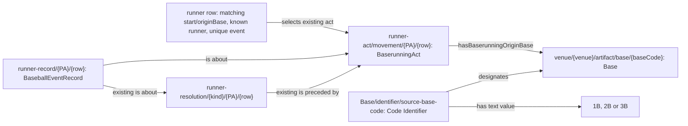

# Baserunning origin: source design

Implements the [accepted origin decision](../../../archive/design-records/mlb-game-baserunning-origin/README.md).
This design precedes its RML additions. Existing actor, act, resolution,
record, Base and code-identifier IRIs are reused.

The context adds `baserunningOriginLinks` for completed plays with a supported
boolean runner resolution, numeric runner identity, matching non-null start
and originBase in 1B/2B/3B, one uniquely matched source event index, and one
row for that runner at that event. Repeated rows at different events retain
their separate act origins. Unknown, conflicting, duplicate and null source
evidence gains no origin link. No prior-state fallback or coalescence occurs.

The first/second/third identifier product uses the already accepted Code
Identifier pattern for both linked origin Bases and adjudicated destination
Bases. It does not assert a physical coordinate or metric ordinal as source
truth. Queries can obtain the categorical code through `designates` and its
text value rather than parse an IRI. Raw source bytes remain untouched.

Source SHACL checks act class, unique origin Base, explicit code, shared
runner/PA/Game/field with the supporting resolution and record aboutness to
the act. It checks linked acts only; a missing link remains unknown.

Focused fixtures use 824315 / PA 12 and PA 64, including the earlier steal
and later single; null batter origin; contradictory origin; duplicate event
or runner row; unknown resolution; wrong runner/PA/field; and missing code or
source-record aboutness. A NiFi single-game proof follows the isolated RML
fixture and focused checks, with no corpus release before terminal proof.
