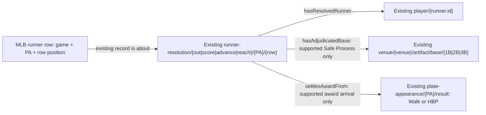

# Resolution and award link implementation

Implements the [accepted three-relation decision](../../../archive/design-records/mlb-game-resolution-award-links/README.md).
This design precedes the RML addition. It adds no identity policy or source.

Context selection retains three lists under each play: `runnerResolutionLinks`,
`adjudicatedBaseLinks`, and `awardResolutionLinks`. They reuse existing RML
resolution-kind selection. They contain joins and reviewed evidence guards,
not calculated metrics, base entitlement or inferred persistence.

Identity links require a numeric runner identity and `isOut` exactly boolean.
Safe destination links additionally require a completed PA and terminal base
1B/2B/3B. Null or unsupported destinations stay unasserted.

The initial award subset requires a completed `walk` or `hit_by_pitch`, one
uniquely indexed terminal pitch, corroborating ball-four or HBP call evidence,
and a unique batter arrival at first. Each forced advance requires explicit
consecutive first/second/third start rows at that event, different runners,
safe arrival at the next base and matching post-PA identity at that base.
A scoring arrival additionally requires `isScoringEvent` true. A gap in the
chain withholds higher links; it does not assert an empty base. Conflicting,
duplicate, mixed-reason or overshooting rows do not establish award completion.
Review-bearing plays are withheld from this initial award subset because
operative review-to-resolution identity remains unresolved.

Independent earlier rows retain their own safe destinations and do not gain
an award link. No generic causal or parthood relation is inferred from the
award link. Existing source record and judgment/decision provenance is reused.
Source SHACL constrains the resulting relation domains, destinations, resolved
runner participation, shared PA/game/field and record/decision structure.

Proof fixtures: 566279 PA 2 (double), PA 12 (balk then walk), PA 23 (steal
then single), 822693 PA 6 (forced walk), and 823016 PA 39 (forced HBP).
Negative fixtures mutate only in-memory copies. Checked-in raw bytes remain.
