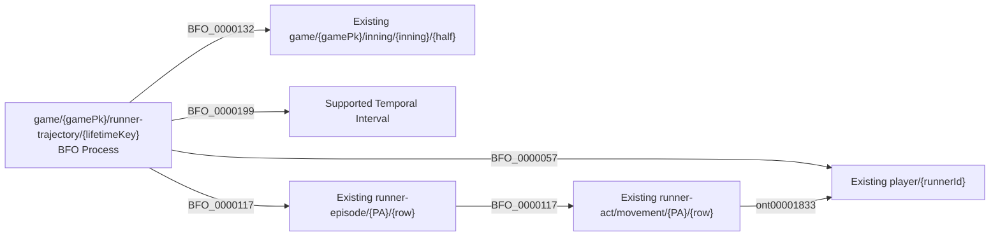

# C1/C2 implementation and source admission boundary

## September 14 implementation update

The user explicitly accepted E1's source authority and the C1 extension of
the existing MLB mapping in [this decision](../../../archive/design-records/metric-source-c1-operation-2026-09-14/review.json).
`prepare-rml-context.py` now reconciles complete half-inning histories before
selecting C1 lifetimes. The existing RML emits the reviewed whole, interval,
participant, half-inning and episode-membership pattern below. No classes,
object properties, location assertions or later safe adjudications are added.

The real 566279 fixture selects 18 lifetimes. Unresolved reviews, offensive
substitutions, missing event anchors, incompatible segment chains and time/out
conflicts withhold the affected half. Reconciliation starts from the full raw
source inventory, not emitted rows. It retains separate contribution episodes,
checks actual post-base observations and preserves stranded runners at the
third-out boundary. A direct batter out without an evidenced baserunning entry
does not create a personal runner whole. Partial/walkoff halves remain withheld
pending supported termination handling.

The lifetime key serializes the supported game/person/entry/termination anchors
as documented in the existing IRI policy. Event timestamps are evidence bounds;
the mapping does not turn them into exact runner timestamps. The whole occupies
its own Temporal Interval without an invented duration or scalar timestamp.

NiFi's RML component compares selected episode membership with actual generated
membership, then relies on the owning source SHACL for graph conformance before
promotion. The RML manifest retains the input hash, source revision, selected
lifetimes, withheld-half reasons and serialization verification after cleanup.
None of this proves a complete season population or supplies the missing
defensive/count-state contracts. The older first-unpassed-gate text below is
historical context; real C1 source selection and mapping are now implemented.

The [accepted decision](../../../archive/design-records/runner-continuity-boundary-projection/review.json)
authorizes C1's BFO Process grain and C2's analytical state projection. It
prohibits new object properties. This module owns the source conformance
profile; no cross-source SHACL or new source lane is introduced.

The current implementation provides:

- `PersonalRunnerProcessShape` in `shacl/authoritative.ttl`, selected by the
  source's `data/game/{gamePk}/runner-trajectory/{lifetimeKey}` IRI grain.
  It requires the Process, its Half Inning and Temporal Interval, existing
  episodes with the same focal runner, and a compatible terminal structure.
  It rejects whole-to-PA containment, whole-level agency/realization, mixed
  runners, cross-game membership, and conflicting counted terminal outcomes.
- The existing metric movement query exposes the whole/half/interval through
  supported episode membership. Those IRIs survive normalization and SQL.
  Observed membership does not prove source or population completeness.
- The SPARQL `runner-boundary-projection` component implements C2 on an
  already admitted, ordered personal history. It produces only an analytical
  base position and supporting event identity. No RDF state predicate, Safe
  Process, stasis, physical location or source-record ICE is manufactured.

## Source-specific shape

This is the accepted source-owned target shape, not a claim that the current
feed supplies a verified lifetime or its interval. IRI serialization must
preserve the accepted lifetime's identity across source revisions and retries.

## First unpassed source gate

No existing source adapter currently produces independently verified complete
personal histories, supported entry/termination anchors and the associated
temporal interval. The checked-in PA 34/35 and 15/16 evidence establishes
positive post-PA observations but does not establish this history. A complete
PA flag, adjacent rows, matching endpoints, or counts of mapped rows cannot
be substituted for the required evidence.

Consequently, no executable RML source for personal wholes is added and no
real game is claimed to contain a newly admitted C1 whole. The existing RML,
raw evidence and source acquisition remain intact. This is a source-evidence
gate, not an outstanding request to approve C1 or C2 again.

The required reconciliation product must bind a particular source revision,
all relevant event membership, operative outcomes/corrections, substitution
effects, the lifetime's endpoints and the evaluation boundary. Acquisition
coverage and source-to-graph coverage must be distinguished; the calculation
helper cannot certify either. NiFi owns that repeatable reconciliation once
the source evidence can supply these inputs. Failed or unknown support must
remain explicit rather than becoming a completeness boolean inferred from
the records the mapping happened to emit.

## C2 binding contract

`project_runner_boundary` accepts one already admitted personal history.
Each event has a unique identity, supported analytical ordinal, known/unknown
state-effect status, whether it changes the runner's state, and an optional
supported safe base position (1, 2 or 3). These are query bindings, not source
fields or ontology properties. Ordinals describe independently established
ordering; raw MLB event indexes do not automatically supply them. Equal
ordinals preserve ambiguity.

The independently supported boundary and complete-history evidence are
required. Select a supported safe observation at or before the boundary only
when no later, or ambiguously concurrent, state-changing/unknown event defeats
it. A newer supported safe outcome can supply the new base. A counted out,
score, substitution, inning ending or unresolved movement cannot carry the
old safe state forward. Ordinary pitches known not to change this runner's
state do not defeat it. Operative review corrections use their supported
corrected outcomes.

Stranding is evaluated at its independently supported boundary, before the
inning reset erases the active runner set. A later inning-ending/reset event
blocks projection beyond that boundary. The projection assigns no positive
batting or running credit; separate contribution rules remain in their owning
calculations. Missing evidence returns unavailable.

Source SHACL validates the graph pattern. SPARQL calculates the projection.
Neither a passing graph shape nor a synthetic calculation fixture demonstrates
that a real source history meets the completeness requirement.
