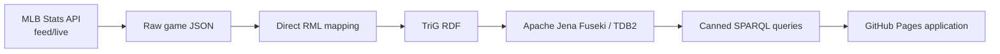

# BaseballO Knowledge Graph

BaseballO transforms untouched MLB `feed/live` game JSON into ontology-aligned RDF. The active implementation maps the raw JSON directly with RML; it does not flatten, normalize, enrich, or store derived statistics.

## Active pipeline



The first proof-of-concept query is **Empty Games**: games in which a player participated offensively without a qualifying offensive contribution. That result must be derived with SPARQL, never stored during ingestion.

## Repository map

| Path | Purpose | Status |
| --- | --- | --- |
| [`ontology/`](ontology/) | Active BaseballO ontology | Active |
| [`mappings/direct/`](mappings/direct/) | Direct raw-JSON-to-RDF RML and validator | Active |
| [`mappings/policies/`](mappings/policies/) | Approved modeling and IRI policies | Active |
| [`source-schema/`](source-schema/) | Observed schema and JSONPath inventory for the sample feed | Active reference |
| [`mermaid/`](mermaid/) | Visual review of the RML source, map, join, and identity shapes | Active review |
| [`data/`](data/) | Raw development inputs | Development only |
| [`archive/`](archive/) | Superseded preprocessing prototype and prior ontology snapshot | Historical |
| [`sparql/`](sparql/) | Future canned queries | Planned |
| [`web/`](web/) | Future GitHub Pages application | Planned |
| [`scripts/`](scripts/) | Future operational scripts | Planned |
| [`tests/`](tests/) | Future integration and regression tests | Planned |
| [`infra/`](infra/) | Pinned local NiFi and Fuseki development stack | Active |

## Validate the active mapping

Install the validation dependency and check the entire repository:

```powershell
python -m pip install -r requirements-dev.txt
python scripts/validate_repository.py
```

The same command runs automatically through [GitHub Actions](.github/workflows/validate.yml) on pushes and pull requests.

To run only the mapping-specific validation, use the following command.

From `mappings/direct`:

```powershell
python validate_direct_mapping.py ../../data/raw/game-566279.json
```

The validator checks the mapping's Turtle structure, locally declared BaseballO classes, the completed-game precondition, source identifiers, observed result coverage, and sample-specific IRI collision risks. It is a static check; successful execution by an RML processor is still required.

## Modeling guardrails

- Treat the MLB JSON as authoritative and leave it unchanged.
- Model people, roles, acts, processes, temporal regions, sites, and information content entities—not stored statistics.
- Reuse canonical `allPlays`; do not remap duplicate API views as new events.
- Build deterministic IRIs from source identifiers.
- Use temporal precedence unless genuine causation is supported.
- Record ontology gaps explicitly. Do not invent classes, properties, or shortcuts.

## RML visual review

Start with the [Mermaid review index](mermaid/README.md). It separates the intended pipeline from the implemented RML shape and highlights places requiring processor tests or modeling decisions.

## Execute the local vertical slice

After bootstrapping and starting the free local stack, follow the [game RDF vertical-slice runbook](scripts/pipeline/README.md). It executes the pinned RMLMapper against the untouched sample, validates source-to-RDF record counts, and loads one complete named graph into Fuseki with an idempotent `PUT`.
