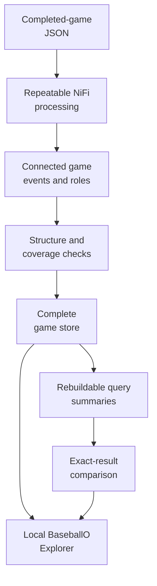
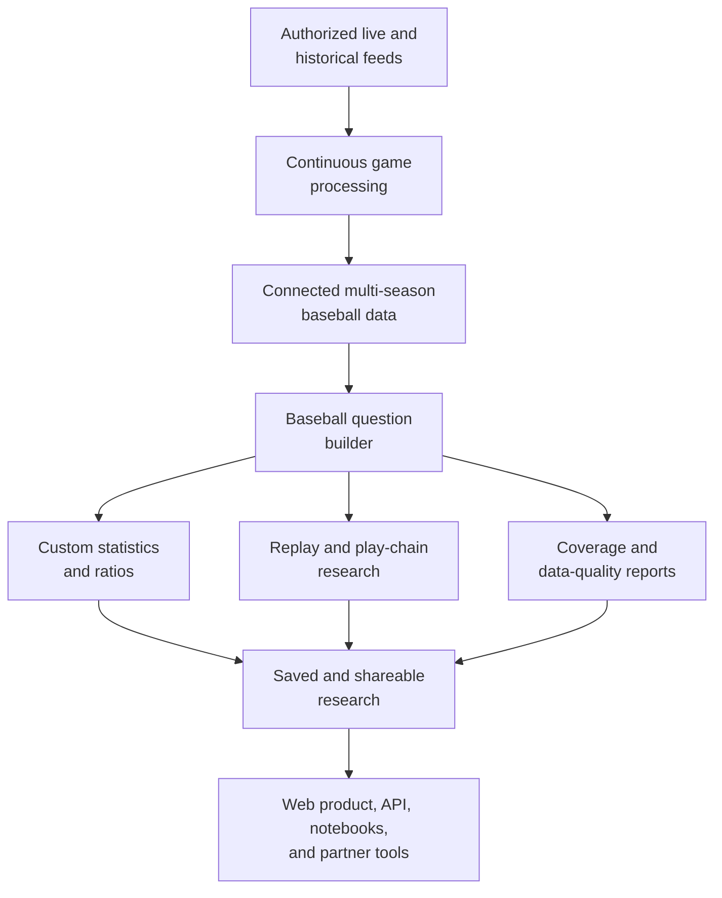

# BaseballO

**BaseballO lets you query baseball as connected game events instead of isolated
statistics rows.**

A normal statistics table is good at questions such as:

- How many hits did a player have?
- How many pitches were called strikes?
- How many games did a team win?

BaseballO is for questions that cross the boundaries between those rows:

- Which called strikes followed a swing, contact, review, or changed decision?
- Who initiated a replay review, what was the original call, and what call
  became final?
- Which pitch, swing, contact, fielding play, and runner movement belong to the
  same play?
- Which team was a player representing in a particular game?
- Which games truly had no qualifying event, and which games have incomplete
  data?
- What percentage of a player's games were Empty Games?

BaseballO keeps the pitch, batter, pitcher, swing, contact, ball movement,
umpire call, replay review, runner movement, and scoring result connected. That
makes it possible to ask across the whole play instead of relying only on the
columns chosen when a statistics table was created.

## What is different from a normal stat table?

| Normal baseball stat table | BaseballO |
| --- | --- |
| Stores a prepared result such as `1 hit` | Stores the game events that can be queried to calculate the hit |
| Has a fixed set of columns | Allows questions across pitches, swings, contact, calls, reviews, runners, teams, venues, and officials |
| Usually treats a player-team relationship as one field | Represents the role a player had for a team in a specific game |
| Often requires a custom table or ETL change for a new statistic | Builds new measurements from reviewed event patterns at query time |
| Can make missing data and zero look the same | Can exclude a game when the required source records are incomplete or unrecognized |
| Returns an aggregate with its definition hidden in code | Shows the measurement definition and generated query with the result |
| Uses the summary table as the data being queried | Keeps the complete game representation and treats faster summaries as rebuildable copies |

A relational database could reproduce many of these features with enough
tables, joins, rules, and custom code. The point is not that tables are
incapable. The point is that BaseballO makes the connections and baseball
meanings part of the shared model instead of rebuilding them separately for
every new analysis.

## A current example: Empty Games

BaseballO currently includes an **Empty Games** measurement: games in which a
player appeared as a batter but recorded no qualifying offensive contribution.

This is not simply "games with zero hits." The current definition checks for:

- singles, doubles, triples, and home runs;
- walks;
- sacrifice flies;
- fielder's choices; and
- explicitly recorded stolen bases.

If a game contains a plate-appearance result that the current mapping does not
recognize, BaseballO excludes that game instead of automatically calling it
empty.

The Explorer can also calculate:

```text
Empty Games / Offensive Games Played
```

Because both counts refer to player-games from the same reviewed set of games,
the result can be labeled as a percentage. Reversing the measurements produces
a ratio instead. The server rejects arbitrary formulas and measurements that
do not use compatible units and groupings.

## What the Explorer can do now

The local read-only Explorer supports:

- batting, pitching, baserunning, game, team, venue, umpire, and scorer
  questions;
- 17 advanced questions involving connected plays, replay reviews, unusual
  event structures, and incomplete records;
- Empty Games and Empty Games percentage;
- compatible numerator/denominator combinations in the Derived view;
- separate Regular season and 2026 All-Star Game query sets, with regular play
  selected by default;
- official-game-date ranges for one day, seven days, 30 days, season to date,
  or a custom range;
- filters for season, game, player, team, and venue where the filter has one
  clear meaning;
- click-to-sort result columns and CSV export; and
- inspection of the generated query used to produce a result.

The checked-in research corpus contains 287 completed regular-season games
dated July 16 through August 6, 2026. The July 14 All-Star Game remains loaded
as a separately selectable game set, and a development fixture is also kept
separate. This is a test corpus, not a complete season or historical database.

## Questions this structure supports

BaseballO is being developed for questions such as:

- How do pitch calls relate to swings, contact, balls in play, and runner
  outcomes?
- How often was an original replay call affirmed or overturned?
- Were reviews initiated by a challenge or by an umpire?
- Which players had the highest Empty Games percentage under the stated
  definition?
- Which games contain broken or incomplete event chains?
- Do faster query summaries return exactly the same rows as the complete game
  representation?
- How should rare baseball events be counted without forcing them into the
  wrong category?

This project is not trying to replace Baseball Reference, FanGraphs, Statcast,
or other established baseball products. Those systems are better for standard
leaderboards, player pages, standings, and historical coverage. BaseballO is
focused on custom questions that need several parts of a game connected at
once.

## Where the project is now

BaseballO is already a working local research system, not just a proposed data
model. Completed-game files can move through one repeatable workflow and become
connected, checked, queryable game data.



Today that system includes:

- 287 regular-season games plus one separately scoped All-Star Game in the
  checked-in raw corpus
- 48 standard queries and 17 advanced queries with reproducible test results
- 18 complete-versus-summary query comparisons with identical results
- a local read-only Explorer with date scoping, filters, derived measurements,
  sortable results, CSV export, and generated-query inspection
- a repeatable NiFi workflow for mapping, checking, loading, indexing, and
  testing games

The implementation uses Apache NiFi for the repeatable game-processing
workflow, RML to map source records, SHACL to check graph structure, and Apache
Jena Fuseki/TDB2 to store and query the games. A baseball user does not need to
know those technologies to use the Explorer.

## A possible product end state

The product opportunity is a research layer between raw game feeds and fixed
leaderboards. Instead of commissioning a new data pipeline for every unusual
question, a baseball organization could build, save, compare, and share new
measurements from the same connected game data.



A mature version could add full-season and historical coverage, continuous
updates, saved definitions, result-to-play drill-down, team workspaces, and an
API for partner products. Those are possible product capabilities, not claims
about the current prototype.

## Potential uses

- New cross-event questions can reuse the existing game connections instead of
  requiring a separate table and pipeline for every analysis.
- Researchers can combine compatible measurements, including percentages and
  ratios, while checking that their units and groupings make sense.
- Pitches, calls, reviews, contact, fielding, runners, and scoring can be
  examined together without manually stitching separate exports together.
- Results can be accompanied by their measurement definitions and generated
  queries, making an analysis easier to inspect and repeat.
- The same connected data can support exploratory research, data-quality
  checks, notebooks, visualizations, and other baseball-analysis tools.

BaseballO is an independent research and development project exploring how
connected game data can support questions that are difficult to express with
fixed statistics tables.

## Run the Explorer locally

```powershell
powershell -ExecutionPolicy Bypass -File Baseball/scripts/infra/start-fuseki.ps1
Set-Location Baseball/web
npm start
```

Open <http://127.0.0.1:4173/>.

See the [Explorer guide](Baseball/web/README.md) for more detail.

## Technical documentation

The active implementation is under [`Baseball/`](Baseball/README.md).

- [Explorer and query builder](Baseball/web/README.md)
- [query library](Baseball/sparql/README.md)
- [game-data mapping](Baseball/mappings/README.md)
- [graph checks](Baseball/shacl/README.md)
- [NiFi and Fuseki infrastructure](Baseball/infra/README.md)
- [selective reasoning](Baseball/reasoning/README.md)
- [current continuation plan](Baseball/NEXT-PHASE.md)

Run the complete repository check with:

```powershell
python Baseball/scripts/validate_repository.py
```
