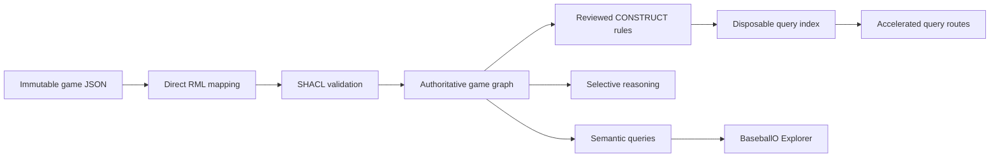

# BaseballO

**An explainable baseball knowledge graph for asking how a result happened—not
only what the final statistic was.**

BaseballO models a game as connected people, roles, acts, physical processes,
locations, times, records, judgments, and outcomes. A pitch can be followed
through a swing, contact, ball motion, adjudication, and runner result while
retaining the source evidence for every claim.

This is an experimental research platform, not a production statistics site.

## Why BaseballO?

FanGraphs and Baseball Reference are better choices for established
leaderboards, historical coverage, conventional statistics, and polished
player pages. BaseballO is intended for questions where the **meaning,
provenance, and structure of the evidence** matter as much as the number.

Instead of storing only a statement such as “the batter had one hit,” BaseballO
can retain the event pattern that supports it:

```text
pitch → swing → contact → batted-ball motion → adjudicated result
```

That makes it possible to inspect how an answer was produced, distinguish
similar baseball concepts precisely, detect incomplete event chains, and build
new analytics from reusable semantic components.

## What the current version can do

The current implementation is a working local vertical slice. It can:

- map untouched completed-game JSON directly to ontology-aligned RDF with RML;
- represent players in game-scoped roles alongside pitches, swings, contact,
  batted-ball motion, locations, judgments, and outcomes;
- preserve full authoritative game graphs while generating smaller disposable
  query-index graphs for reviewed high-value query patterns;
- validate authoritative and indexed graphs with 30 SHACL node shapes;
- run 48 canned SPARQL queries and 16 advanced event-chain analytics with
  reproducible corpus baselines;
- answer batting, pitching, baserunning, game, venue, team, and official-related
  questions through a local read-only Explorer;
- group batting, pitching, and baserunning results by game-scoped team, and use
  shared season, game, team, and venue filters across normal, Advanced, and
  Empty Games views;
- calculate the evidence-bounded **Empty Games** analytic without storing it
  during ingestion;
- expose generated SPARQL, execution metadata, tabular results, and CSV export;
- visually audit all 247 RML triples maps through generated, pattern-sized
  Mermaid diagrams;
- prove equivalence between authoritative and indexed results for 18 reviewed
  query routes; and
- apply three selectively budgeted reasoning profiles to one explicitly chosen
  plate appearance, with pinned BFO CLIF inputs and 107 checked first-order
  proof obligations.

The checked-in audit corpus currently contains eight completed games from
2026-08-03 plus a separate development fixture. This is enough to test the
architecture, not enough to claim season-scale statistical coverage.

## What a mature version would do

A mature BaseballO platform would extend the same evidence-preserving design to
an authorized, season-scale or historical corpus. It would provide:

- a consistent visual question builder for ordinary, advanced, and
  completeness-sensitive analytics;
- reusable grouping and filtering by season, game, team, player, venue, umpire,
  event type, and other semantically valid dimensions;
- game-scoped team membership so trades and historical roster changes are
  represented correctly;
- composable questions across event chains—for example, relating pitch result,
  swing behavior, contact, venue, umpire, game state, and eventual outcome;
- plain baseball terminology with visible definitions whenever a measurement
  is partial, inferred, or dependent on source completeness;
- drill-down from every aggregate result to the events and source records that
  justify it;
- automatic detection of missing, contradictory, or structurally suspicious
  game evidence;
- a fast query layer that can be discarded and rebuilt from the full graph
  without weakening the authoritative model;
- selective reasoning invoked only for bounded questions where its additional
  conclusions justify the computational cost;
- reproducible research packages containing query text, graph version,
  validation status, inference profile, and result provenance; and
- stable local and service APIs for research tools, visualizations, notebooks,
  and other baseball applications.

The goal is not to reproduce a fixed menu of familiar statistics. The goal is
to make baseball events into reusable, inspectable knowledge from which both
familiar and previously unanticipated questions can be asked.

## Who this is for

BaseballO is aimed at:

- baseball researchers who need custom, reproducible questions;
- analysts who want to inspect the assumptions behind a measurement;
- knowledge-graph and ontology practitioners working with event data;
- data engineers evaluating semantic validation and query acceleration; and
- educators demonstrating how raw records become defensible claims.

## Architecture



The active stack uses free and open-source infrastructure, including Apache
Jena Fuseki/TDB2 and Apache NiFi. Raw source files are immutable, derived
statistics remain downstream, and inferred or accelerated graphs never replace
the authoritative event graph.

## Current boundaries

- BaseballO is local and experimental; it is not publicly hosted.
- Automated live acquisition is disabled pending an approved data source.
- The current corpus is intentionally small.
- Some source events remain explicitly generic where the available evidence
  does not justify a more specific assertion.
- Advanced absence-based analytics run only within documented completeness
  boundaries.
- Reasoning is selective and bounded; there is no full-corpus closure mode.

## Explore the repository

The active project is under [`Baseball/`](Baseball/README.md). Useful starting
points include:

- [local Explorer](Baseball/web/README.md)
- [query library](Baseball/sparql/README.md)
- [RML mapping and policies](Baseball/mappings/README.md)
- [generated Mermaid review](Baseball/mermaid/README.md)
- [SHACL validation](Baseball/shacl/README.md)
- [selective reasoning](Baseball/reasoning/README.md)
- [current continuation plan](Baseball/NEXT-PHASE.md)

## Validate the project

From the repository root:

```powershell
python -m pip install -r Baseball/requirements-dev.txt
python Baseball/scripts/validate_repository.py
```

The validator checks the ontology overlay, RML, raw fixtures, generated Mermaid
documentation, SHACL shapes, SPARQL corpus, query-index equivalence contracts,
Explorer, selective reasoning contracts, and first-order proof obligations.
