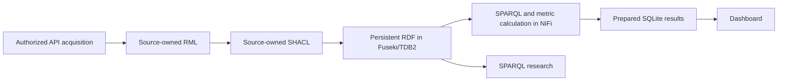

# BaseballO

BaseballO connects baseball events so researchers can ask questions across
pitches, swings, contact, calls, replay reviews, runner movement and scoring.
The authoritative RDF preserves those relationships; prepared SQL results
serve the metric dashboard.

## Dashboard

The local dashboard is at <http://127.0.0.1:4173/metrics>. It defaults to the
full latest loaded season and automatically refreshes the selected date range.
Each of the 19 public metric cards shows player names and values, with up to
five leaders and expanded details on selection. Values are selected-period
player averages, except **Empty Games**, which is a game count. Participation
minimums apply to averages and rates; Empty Games has no appearance minimum.
Source and population completeness requirements still apply.

**The dashboard is not yet fully populated.** See the
[current metric readiness table](Baseball/serving/METRIC-READINESS.md) for
remaining gaps and verified results. SQL health, successful ingestion and
passing arithmetic checks do not establish complete player populations.
Machine-local publication evidence determines what is currently available.

The [worked examples](Baseball/web/metric-worked-examples.md) explain every
public metric using hypothetical inputs. Role Realization Breadth remains a
backend calculation.

## Run locally

From the repository root on the configured Windows workstation:

```powershell
powershell -ExecutionPolicy Bypass -File Baseball/scripts/infra/launch-explorer.ps1
```

The launcher starts or reuses Fuseki, NiFi and the local web server. Open
`/metrics` for the dashboard or `/` for the legacy Explorer. The
[web guide](Baseball/web/README.md) covers setup, the desktop shortcut and
route behavior. This is a local research system, not a public deployment.

The legacy Explorer retains reviewed SPARQL questions, filters, sortable
results, CSV export and query inspection. Its PAQ-1/Good At Bat and Empty Games
prototypes are separately versioned and do not define the new metrics.
Only admitted legacy routes use SQL; other legacy questions may still run
SPARQL. Dashboard requests read prepared SQL exclusively.

## How it works


```mermaid
flowchart LR
    API[Authorized API acquisition] --> RML[Source-owned RML]
    RML --> SHACL[Source-owned SHACL]
    SHACL --> RDF[Persistent RDF in Fuseki/TDB2]
    RDF --> BUILD[SPARQL and metric calculation in NiFi]
    BUILD --> SQL[Prepared SQLite results]
    SQL --> UI[Dashboard]
    RDF --> RESEARCH[SPARQL research]
```

Seven detachable MLB modules own Games, Teams, Leagues, Divisions, People,
Venues and Transactions. Apache NiFi runs acquisition, mapping, validation,
promotion, retries and derived builds. Source contracts describe specific
accepted coverage; successful ingestion does not mean every MLB field is mapped.

Metric, SQL and UI work starts from existing RDF. Authorized source repairs
stay targeted and preserve unrelated facts. New source acquisition or a full
RDF rebuild is not a prerequisite for changing a query or dashboard.
The [operating policy](AGENTS.md#incremental-work-and-minimal-manual-validation)
assigns each layer its responsibilities.

## Documentation

| Start here | Purpose |
| --- | --- |
| [Project guide](Baseball/README.md) | Architecture, serving products and repository map |
| [Roadmap](Baseball/ROADMAP.md) | Next work |
| [Metric readiness](Baseball/serving/METRIC-READINESS.md) | Dashboard delivery and remaining gaps |
| [Source modules](Baseball/sources/README.md) | Source contracts and ownership |
| [MLB game repair plan](Baseball/sources/mlb-game/review/rml-audit-2026-10-03.md#current-repair-plan-and-scope) | Diagnosed RML work and recorded closure |
| [Query library](Baseball/sparql/README.md) | Analytical queries and source scopes |
| [NiFi runbook](Baseball/infra/nifi/README.md) | Asynchronous operation and submission |
| [Evidence corpus](Baseball/data/README.md) | Fixed checked-in samples, separate from live coverage |
| [Repository layout](Baseball/REPOSITORY-LAYOUT.md) | Active artifacts and historical records |

Accepted decisions and dated benchmark captures remain historical evidence.
They do not report live runtime status. NiFi's separate Repository Evidence
observer owns aggregate validation; local changes use the focused checks in
[AGENTS.md](AGENTS.md).
