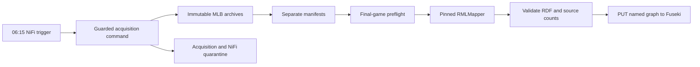

# NiFi flow boundary

The daily game flow implements this contract:



The response body remains the exact MLB payload. Routing metadata such as `gamePk`, request time, source URL, HTTP status, and checksum belongs in FlowFile attributes and acquisition manifests—not in rewritten JSON.

NiFi is an orchestrator here, not a semantic modeler. It must not write to or modify `ontology/BaseballO.ttl`. Only validated RDF generated by the approved RML mapping may reach Fuseki.

The initial process group will use these parameters rather than machine-specific paths embedded in processors:

| Parameter | Local development value |
| --- | --- |
| `baseballo.pipeline.root` | `%LOCALAPPDATA%\BaseballO\state\pipeline` |
| `baseballo.fuseki.base` | `http://127.0.0.1:3030` |
| `baseballo.fuseki.dataset` | `baseball-dev` |
| `baseballo.fuseki.graph-store` | `http://127.0.0.1:3030/baseball-dev/data` |
| `baseballo.mlb.api.base` | `https://statsapi.mlb.com/api` |

Secrets do not belong in the flow definition or these tracked files.

Create or repair the initial process-group hierarchy through NiFi's authenticated local API:

```powershell
.\scripts\infra\configure-nifi-foundation.ps1
```

The command is idempotent. It creates missing groups but does not replace, delete, start, or stop existing flow components.

Create the visual processor skeleton inside `90 Shared RDF Mapping and Load` with:

```powershell
.\scripts\infra\configure-nifi-rdf-skeleton.ps1
```

This command adds five deliberately stopped, unconnected processors representing the shared semantic boundary. They remain a visual decomposition of the internal guarded command.

The `01 Games - Daily` group contains the executable scheduled flow. Configure it without starting it:

```powershell
.\scripts\infra\configure-nifi-games-daily.ps1
```

The idempotent command creates four valid processors and three connections: a 06:15 local trigger, `ExecuteStreamCommand`, successful-run logging, and failed-output persistence. Use the controlled run and enable commands in the [pipeline runbook](../../scripts/pipeline/README.md).
