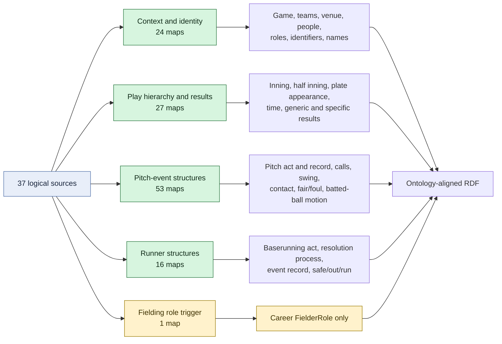

# Triples-Map Families

All 121 triples maps are represented below as five functional families. Counts are derived from the current RML file.

## Map-count accounting

| Family | Count | Included logical-source groups |
| --- | ---: | --- |
| Context and identity | 24 | root, teams, venue, players, officials |
| Play hierarchy and results | 27 | canonical plays, last play, eleven filtered result types |
| Pitch-event structures | 53 | all pitches, batted pitches, and pitch-call filters |
| Runner structures | 16 | generic runner source and five outcome filters |
| Fielding | 1 | fielding-credit records used only to trigger Fielder Roles |
| **Total** | **121** | |

The large pitch family is deliberate reuse of source records for distinct process individuals, but it makes pitch call-code coverage and event-chain review especially important.
