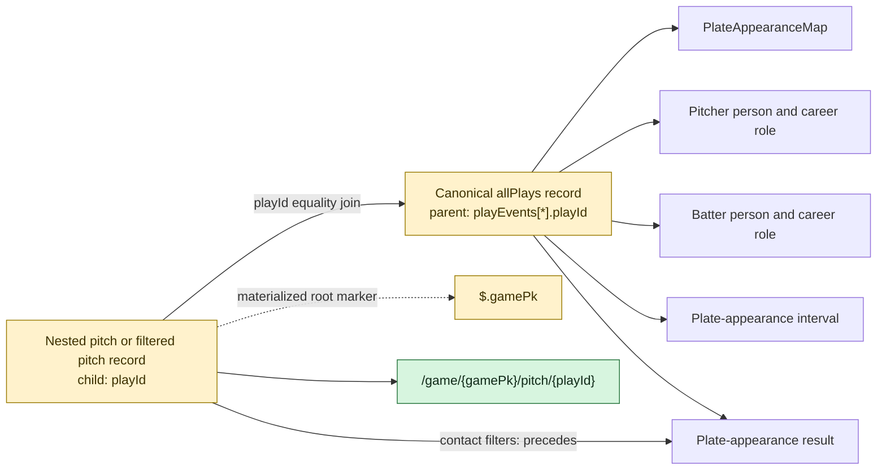
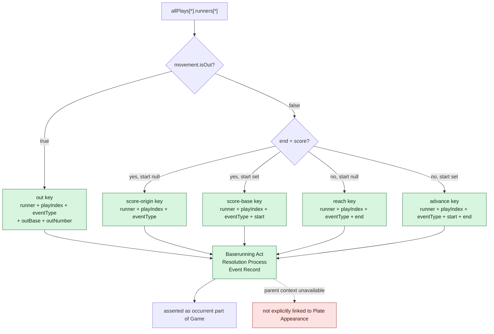

# Joins and Identity Shape

## Pitch-to-play joins

All 44 referencing-object-map joins use the same equality condition. Thirty-nine connect pitch-derived structures to their enclosing play context; five additionally connect contact processes to the plate-appearance result.

The execution harness resolves the root marker in its temporary mapping copy because mapper references are relative to the current iterator record. The remaining processor-sensitive feature is the join whose parent reference yields the `playEvents[*].playId` collection.

## Runner identity

Runner records expose neither a stable record ID nor their array index as a JSON value. The direct mapping therefore partitions records into five patterns and builds composite IRIs from fields present in each record.

The sample validator found 113 unique composite keys for 113 runner records. That proves collision freedom only for the development feed, not for every MLB game.
