# RML Shape Evaluation

```mermaid
flowchart TB
    REVIEW["Current direct RML shape"]
    REVIEW --> STRONG["Structurally strong or corrected"]
    REVIEW --> TEST["Needs processor test"]
    REVIEW --> DECIDE["Needs modeling or identity decision"]

    STRONG --> S1["Untouched source"]
    STRONG --> S2["Canonical allPlays"]
    STRONG --> S3["Stable source-backed global IRIs"]
    STRONG --> S4["Generic result fallback"]
    STRONG --> S5["No stored statistical totals"]
    STRONG --> S6["Contact precedes PA result"]
    STRONG --> S7["Unsupported geographic typing removed"]

    TEST --> T1["Absolute JSONPath references"]
    TEST --> T2["Filtered JSONPath syntax"]
    TEST --> T3["allPlays[-1:] terminal slice"]
    TEST --> T4["Multi-value parent join reference"]
    TEST --> T5["Season-scale repeated scans"]

    DECIDE --> D1["Runner identity and PA linkage"]
    DECIDE --> D2["Pitch identity when playId is absent"]
    DECIDE --> D3["Venue latitude/longitude ICE class"]
    DECIDE --> D4["Career-role TBox wording"]
    DECIDE --> D5["Measurements, actions, fielding acts"]

    classDef strong fill:#d7f5df,stroke:#24733b,color:#102a18;
    classDef test fill:#fff2cc,stroke:#997a00,color:#3d3100;
    classDef decide fill:#fde2e2,stroke:#a33,color:#4a1111;
    class STRONG,S1,S2,S3,S4,S5,S6,S7 strong;
    class TEST,T1,T2,T3,T4,T5 test;
    class DECIDE,D1,D2,D3,D4,D5 decide;
```

## Findings

| Severity | Finding | Why it matters |
| --- | --- | --- |
| High | RML processor execution is still unverified. | Turtle parsing does not establish that the selected processor supports the nested absolute references, filters, terminal slice, or multi-value parent joins. |
| High | Runner acts and resolutions are linked to the game, not explicitly to their plate appearance. | The requested temporal/process hierarchy cannot be fully traversed at the runner level. The raw runner object lacks parent scope and array identity. |
| High | Pitch IRIs require `playId`, although project policy describes it as optional. | The mapping cannot yet claim universal completed-game coverage unless every mapped pitch has a unique `playId` or another direct identity strategy is approved. |
| Resolved safely | Venue latitude/longitude mapping is deferred. | The previous field-relative `BaseballFieldCoordinateICE` typing was removed; the source values remain untouched pending approval of an appropriate geographic-coordinate ICE class. |
| Resolved safely | Contact processes now precede their plate-appearance result. | Five source-backed joins connect foul, foul-tip, and in-play contact maps to the enclosing generic or specifically typed result without asserting causation. |
| Medium | Inning and half-inning processes have no separately mapped temporal intervals. | Plate appearances have source times, but deriving container bounds requires aggregation or processor functionality not currently represented in direct RML. |
| Medium | Pitch-call and result-specific coverage is based on values observed in one sample. | Unseen values fall back safely only at the generic pitch or institutional-result level; they will lack more specific process typing until reviewed. |
| Deferred | Action events, field-relative coordinates, pitch/batted-ball measurements, and individual fielding acts are not mapped. | These are already documented ontology or identity gaps and should remain explicit rather than being approximated. |

## Interpretation

The RML is a substantial direct-mapping draft, not yet a complete processor-proven mapping for arbitrary completed MLB games. The diagrams make the next work separable: processor compatibility can be tested without changing ontology decisions, while red findings require explicit approval before semantic changes.
