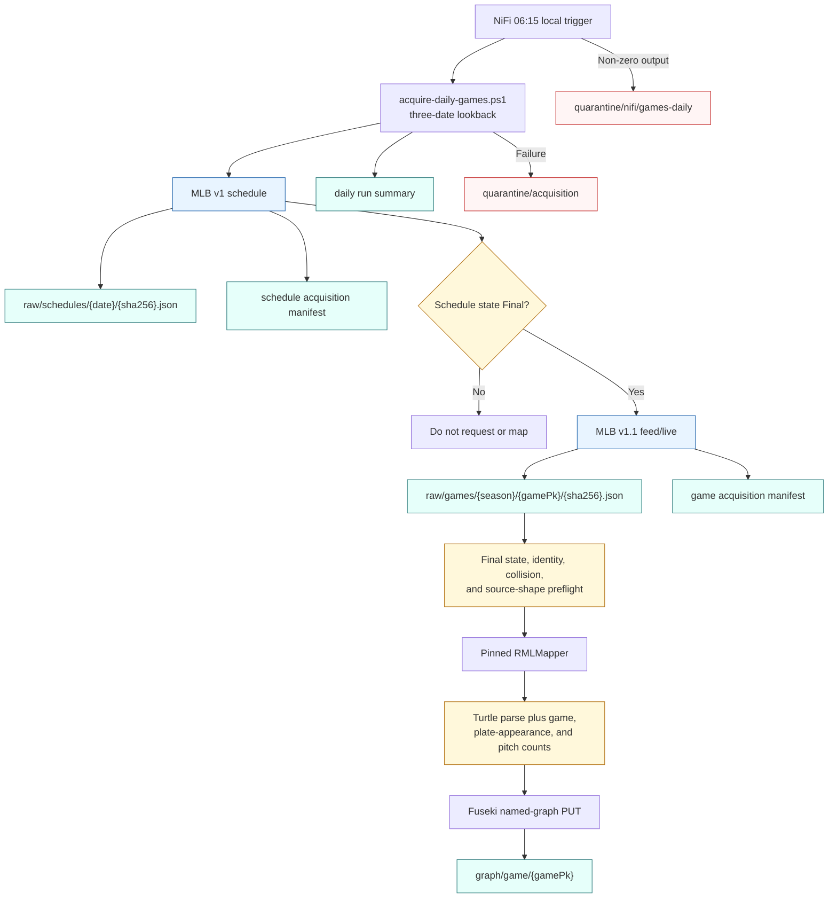

# Daily game acquisition

This diagram describes the implemented operational path. NiFi schedules and observes the run; the guarded scripts preserve source bytes, enforce mapping preconditions, and load only validated RDF.

The source JSON never receives helper fields. Root identifiers required by nested RML subjects are inserted only into an isolated mapping copy, and every run records the source and effective mapping hashes.
