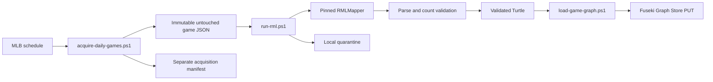

# Daily game acquisition and RDF loading

These scripts implement the tested path from MLB schedule discovery through an archived, completed game response to its Fuseki named graph.



Run the controlled historical sample from the repository root:

```powershell
.\scripts\pipeline\acquire-daily-games.ps1 -Date 2019-04-01 -GamePk 566279 -ForceRdfLoad
```

With no filters, the acquisition script requests yesterday and the preceding two dates. It stores schedule and `feed/live` bodies by SHA-256, writes retrieval metadata separately, maps only final games, and continues across individual game failures before returning a failed daily run. Repeating an identical response never overwrites its archive. It skips remapping only when the raw hash, tracked mapping hash, mapper version, RML manifest, and expected Fuseki game assertion all match; `-ForceRdfLoad` overrides that optimization.

`run-rml.ps1` requires a final game, runs the mapping-specific collision and source preflight, stages a byte-identical JSON copy, materializes the guarded root-identifier markers only in its temporary mapping copy, invokes the pinned mapper in strict mode, and validates the resulting game, plate-appearance, and pitch counts. It records input, source-mapping, effective-mapping, and output hashes in a separate manifest.

`load-game-graph.ps1` parses the Turtle again before using Graph Store Protocol `PUT`. Repeating the load replaces the same graph rather than appending duplicate statements.

## NiFi schedule

Configure the connected flow, run the controlled test, then enable the daily trigger:

```powershell
.\scripts\infra\configure-nifi-games-daily.ps1
.\scripts\infra\configure-nifi-games-daily.ps1 -TestDate 2019-04-01 -TestGamePk 566279 -RunOnce
.\scripts\infra\configure-nifi-games-daily.ps1 -EnableDaily
```

NiFi runs at 06:15 in the machine's local timezone. The three-day lookback catches recent dates after a short outage, but NiFi and Fuseki must be running when the trigger fires.
