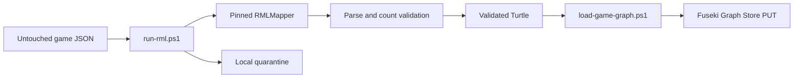

# Game RDF vertical slice

These scripts implement the tested local boundary between an archived, completed MLB game response and its Fuseki named graph.



Run from the repository root:

```powershell
.\scripts\pipeline\run-rml.ps1 -InputJson .\data\raw\game-566279.json
$rdf = "$env:LOCALAPPDATA\BaseballO\state\pipeline\rdf\game-566279.ttl"
.\scripts\pipeline\load-game-graph.ps1 -RdfFile $rdf -GamePk 566279
```

`run-rml.ps1` requires a final game, stages a byte-identical JSON copy, materializes the guarded root-identifier markers only in its temporary mapping copy, invokes the pinned mapper in strict mode, and validates the resulting game, plate-appearance, and pitch counts. It records input, source-mapping, effective-mapping, and output hashes in a separate manifest.

`load-game-graph.ps1` parses the Turtle again before using Graph Store Protocol `PUT`. Repeating the load replaces the same graph rather than appending duplicate statements.
